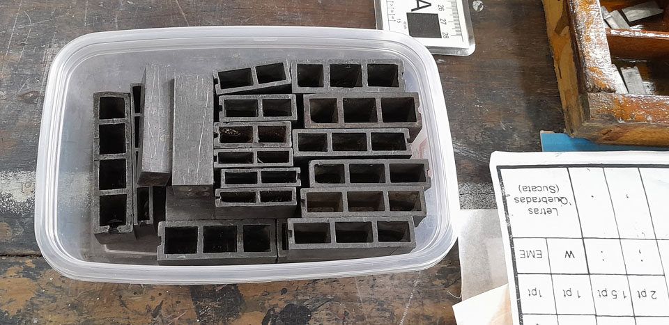

Pingo é letra, entendes?  
Pingo de chumbo verte e se converte em letra. E também pontos e outros sinais. Invertidos. 
Escreve-se da esquerda para a direita, de cima para baixo.  
Para multiplicar, compunha-se a escrita da direita para a esquerda, de cima para baixo, com letras ao contrário. Prende, entinta, baque: impresso. Ofício febril.  

Letras invertidas vertidas do chumbo são tipos.  
Do grego, τύπος, que pode ser: um golpe ou pressão; o que resulta disso (marca, impressão);  figura, imagem ou contorno; o caráter geral de uma coisa, classificação; um conteúdo padrão, exemplo ou modelo; uma invocação.  
Do τύπος deriva a Tipologia (τύπος+λόγος, tipo+estudo, razão: tratado sobre tipos, classificação de tipos) e a Tipografia (τύπος+γράφειν, tipo+escrita, registro: escrita com tipos). A tipologia tem um uso mais abrangente e comum em ciências, posto que alude à classificação a partir de modelos. O atípico também é derivado do τύπος. Na oficina todas derivações têm lugar.

Juntaram-se, aqui na oficina, uma miríade de pingos de chumbo feitos letras, pontos, números e sinais. As origens são variadas: do abandono, do quase derretimento para virar outra coisa, do acaso, do herdado, do pix.  
Primeiro, moram em caixas de peixaria. E, como nelas, começa-se com a separação dos resíduos orgânicos e inorgânicos, humanos e não humanos. Pelos resíduos é possível imaginar de onde vieram. Depois vem a limpeza: banha (no querosene), escova, seca. 
Seguem para a primeira etapa tipológica: classificar por tamanho. A largura do tipo nos diz seu número, seus pontos, seu corpo. Próxima etapa tipológica: separar por formato. Os tipos de mesmo corpo são agrupados, agora, pelas características de forma das letras: mais compridinhas, mais achatadinhas, mais arredondadas, inclinadas, mais fininhas, mais grossinhas… cada uma destas formas têm nomes oficiais: condensed, bold, italic… mas por ora o que vale é atentar para a característica principal e agrupar por parecenças num outro recipiente, que não é mais a caixa de peixaria, mas o pote de sorvete, de margarina e de outros comestíveis. Reunião de família.  
Cada família ganha uma gaveta. As gavetas, diga-se, compartilham origens com os tipos. Precisaram ser resgatadas, reformadas, limpas, envernizadas. Tudo feito na oficina também. A organização dos tipos nas gavetas é homogênea, é um tipo de organização específica para tipos. A gaveta, também chamada de caixa tipográfica, é subdividida em caixotins, uns maiores, outros menores, a depender da recorrência da letra na língua.  
Na parte superior esquerda vão as letras maiúsculas, em ordem alfabética (ou quase isso); na parte superior direita, as letras acentuadas e vários sinais gráficos e de pontuação. Na parte inferior vão as letras minúsculas, os números, sinais diversos e os espaçadores. Letras mais recorrentes ganham os caixotins maiores e mais centralizados. Os tipos das letras **b** e **d**, **p** e **q** dão muito trabalho e são os que mais exigem a troca de chave para ler invertido. Não raro, quase vão parar no caixotim errado. Na dúvida, carimbamos o tipo em papel mole, no dorso da mão ou num pedaço de borracha “limpa tipos”, para ter certeza. E é, também, preciso atentar para o pequeno sulco que cada tipo tem em uma de suas faces, que precisam ficar na mesma posição para se ler a letra ou o símbolo, para que u não vá parar no caixotim de n e i não vá parar no caixotim de !  
Este terceiro processo precisa ser bem minucioso, o pente fino onde se detecta o que, eventualmente, as primeira e segunda etapas deixaram escapar  (ou foram os tipos mesmo que preferiram outros corpos e outras famílias, vai saber?). Algumas letras dão pistas para identificar a família. G é uma delas. Tem o g gatinho e o g seco, por exemplo.

Na medida em que as caixas tipográficas ganham volume de tipos, as famílias ganham seus nomes, o que é feito a partir de consulta a catálogos. Passa a se chamar “fonte”. Este é o coração da tipologia da tipografia.  
E, por fim, determinada a fonte, a caixa tipográfica é grafada com seu nome, sobrenomes, títulos e corpo, tal como Grotesca Meia Preta Larga Normal 12pts, com uma belíssima caligrafia. 

_o pote com os elementos brancos comprados na graphotipo e trazidos na bagagem da autora, janeiro 2026, fotografia de aline dias_

Até agora passaram pelo processo de limpeza, classificação e arrumação nas gavetas aproximadamente ______ mil tipos e ____ fontes já foram identificadas; ___ gavetas foram recuperadas e hoje há ___, para as quais foi feito um móvel específico. Ainda faltam ___ caixas de peixaria, volume estimado de ___ mil tipos a limpar e classificar, e vira-e-mexe mais tipos são agregados ao acervo.

texto de Gisele Girardi, dez. 2025
