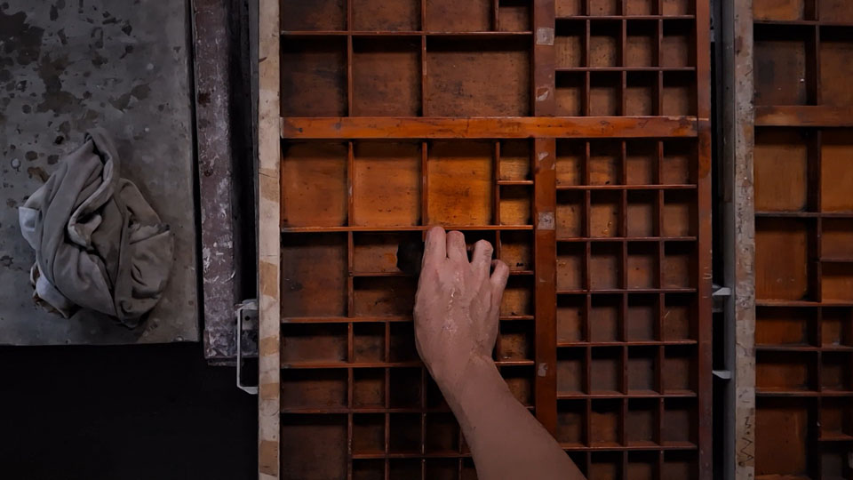
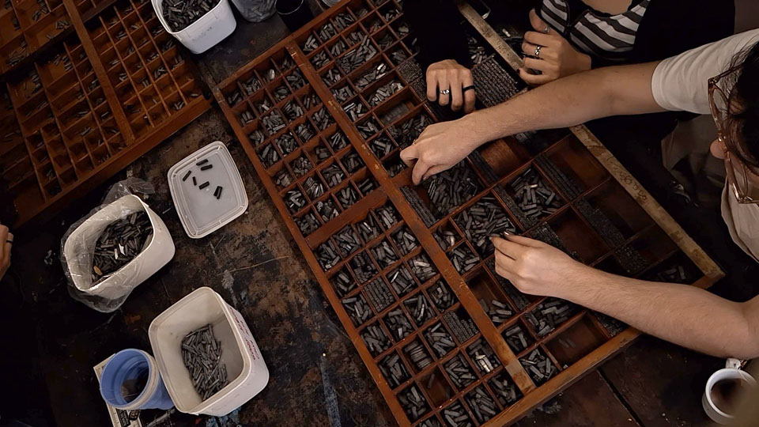
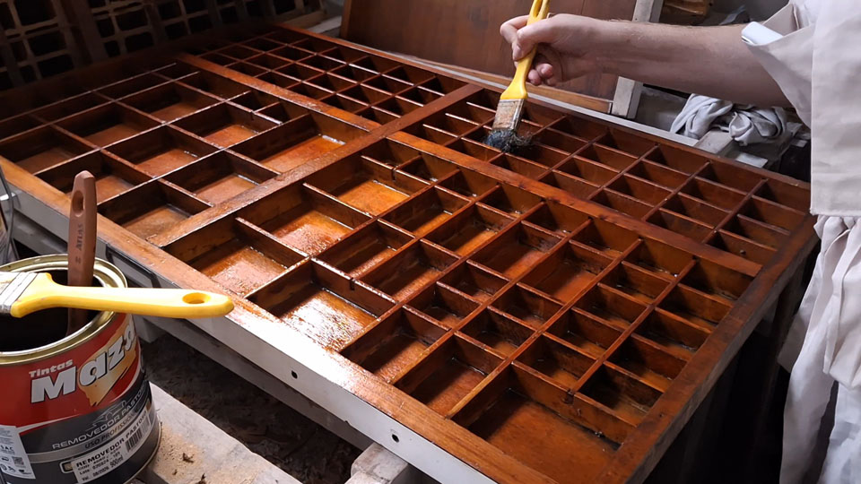
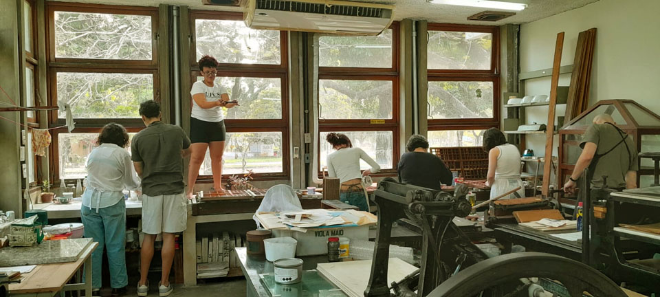

  
um relato de iolanda callado, dez 2025

as mãos não param  
elas não falam  
no entanto,  
as palavras jamais calam  
– no papel  

na sala 6, minhas mãos estão sempre atentas. elas calçam as luvas para limparem os tipos e os separam por tamanho e fonte. às vezes tremem, já não sei se pelos tremores de todos os dias ou pela quantidade de café que ingeri durante as pausas e conversas paralelas nos encontros semanais do grupo. aliás, minhas mãos também colocam o papo em dia, gesticulam e batem palmas durante risadas escandalosas. elas não me deixam descansar, às vezes acho que têm vida própria. então elas voltam ao trabalho.

registro o cotidiano da oficina com meu celular. capturo uma cena com o olhar, posiciono, meus dedos ajustam as configurações da câmera para pegar o melhor da iluminação da sala e clicam no botão para gravar. repito sempre esse processo. posicionar, clicar e gravar. minhas mãos registram as mãos que trabalham ora nas gavetas, ora na limpeza ou na prensa.

_mutirão dedicado a limpeza e restauro de gavetas na oficina de tipografia, outubro de 2025, fotografia de iolanda calado_

as gavetas precisam ser limpas antes de toda organização, os dedos estão em cada vão e cantinho das repartições para envernizar a madeira em seguida. assim, cada abc está no seu lugar, graças às mãos que organizam os tipos de acordo com a fonte e tamanho. depois de compôr as frases, essas mãos levam a matriz para a prensa e trabalham incansavelmente até uma impressão satisfatória. limpar, organizar e imprimir. são processos que nunca se acabam, porque é preciso descobrir novas fontes. sempre há movimento na oficina porque nunca as palavras acabam. 

_processo de separação de tipos, outubro de 2025, fotografia de iolanda calado_

mesmo com as tarefas diversas e inesgotáveis que é possível realizar na oficina,  ainda me pergunto o motivo pelo qual ainda não fiz uma impressão, já que, pelo visto, assim como as outras, as minhas mãos tem muito a contar – não sei mais se preciso deixar meu ímpeto criativo fluir ou minhas mãos falarem (à sua maneira).

_aplicação de verniz nas gavetas na oficina de tipografia, 2025, fotografia de iolanda calado_

_processo de impressão na prensa pérola, 2025, fotografia de iolanda calado_

(obs.: não é bem um relato de experiência)

_vista da sala com mutirão dedicado a limpeza e restauro de gavetas na oficina de tipografia, outubro de 2025, fotografia de iolanda calado_

