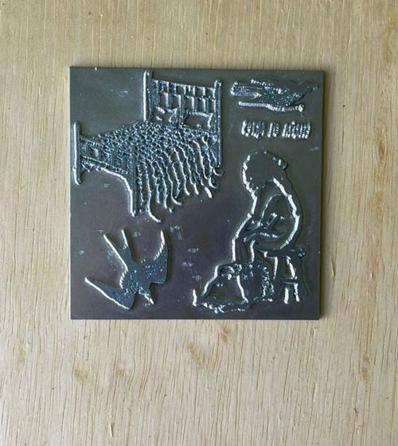
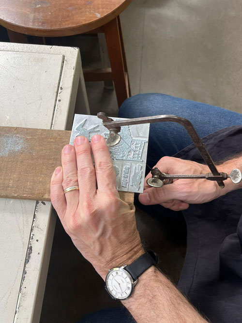
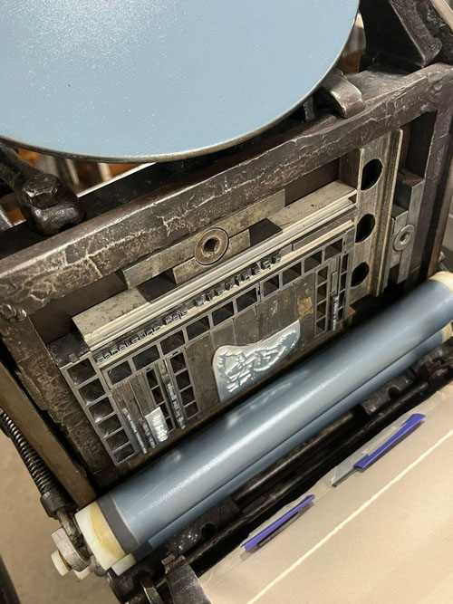
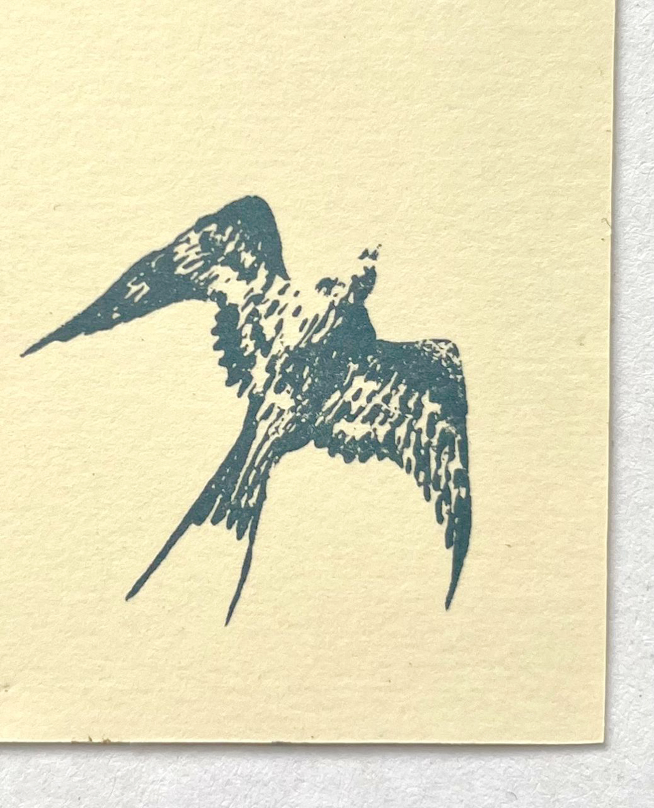

 
Os clichês metálicos passaram a ser frequentemente utilizados a partir do século XIX nas composições tipográficas com texto e imagem. No mesmo contexto de demanda pela reprodutibilidade que a xilogravura e a gravura em metal, o clichê se popularizou nesse meio pela qualidade da imagem na impressão e sua facilidade de manuseio. Ele é posicionado junto com os tipos móveis na rama tipográfica, por vezes colado em pedaços de madeira ou simplesmente fixado nos espaços brancos.  

_detalhe dos clichês na placa de zinco, 2025, fotografia de isabella de campos_

O funcionamento do clichê tipográfico é semelhante ao de um carimbo, ou seja, a imagem fica em destaque na matriz e as áreas sem imagem ficam rebaixadas. A placa de metal recebe um tratamento químico para a revelação da imagem, que pode ser feita por alguns processos, como galvanotipia ou fotogravura com fotolitos. Apesar de no ateliê não termos recursos para produzir nossas próprias matrizes, fazemos o preparo das imagens para enviar para a Clicheria Vitória.  
Antes de ser enviada para a clicheria, as imagens escolhidas são vetorizadas por mim e posicionadas em um único arquivo. Quase sempre colocamos mais de um desenho em uma mesma placa, para otimizar o espaço e, consequentemente, o custo. Com a placa de metal pronta, o professor Diego Rayck faz a separação dos desenhos por meio de cortes com uma serra de fio, o que também reduz as marcas das bordas. Para isso também, usando uma lima, lixamos os cantos e arredondamos as bordas, e assim o clichê fica pronto para uso. 

Um relato de Isabella de Campos, dez. 2025

_processo de preparação dos clichês, diego serrando as bordas, 2025, fotografia de Isabella de campos_

Para imprimir, fixamos o clichê com fita dupla face diretamente nas guarnições da rama tipográfica, já posicionado no local onde desejamos que o desenho fique na composição. 

_processo de impressão, vista do clichê na prensa, 2025, fotografia de isabella de campos_

_detalhe de uma impressão de clichê, 2025, desenho e fotografia de isabella de campos_

