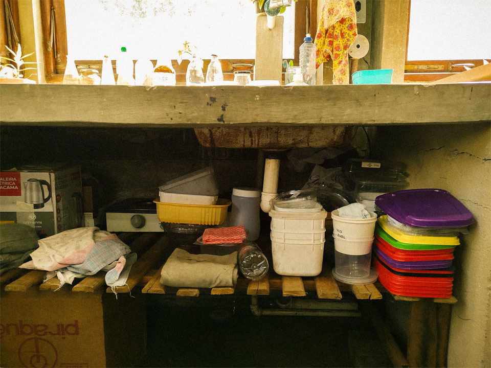
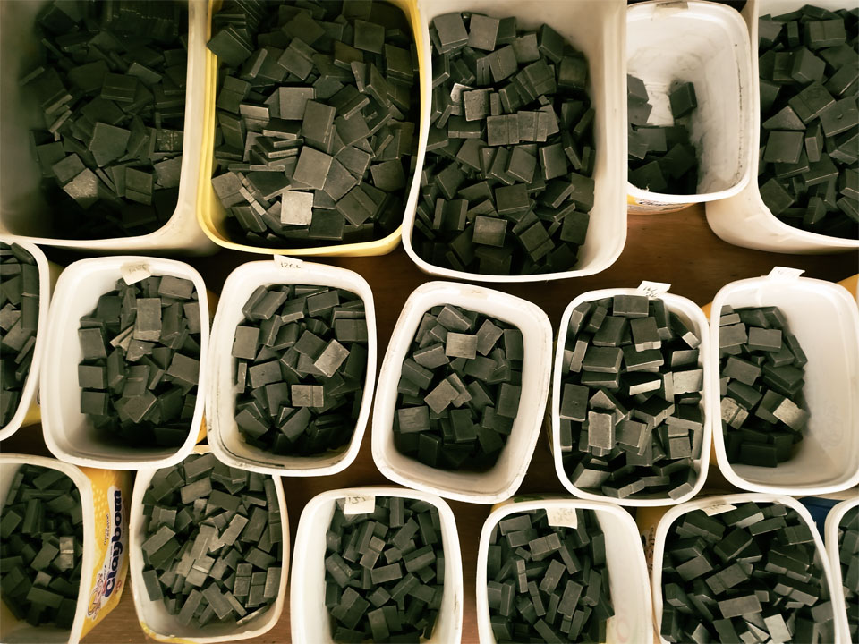
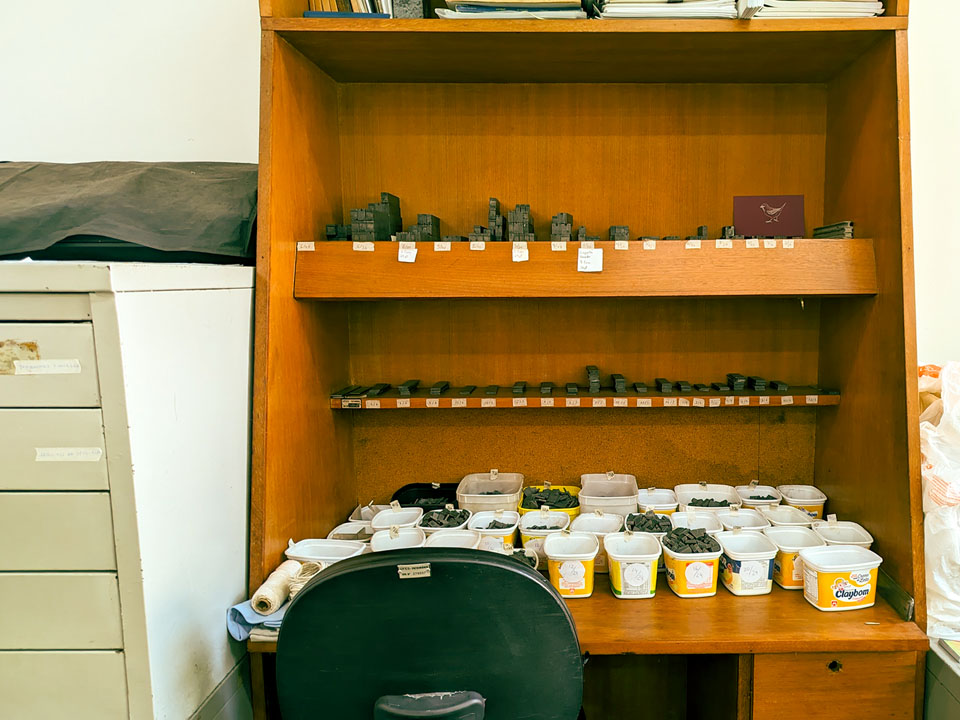
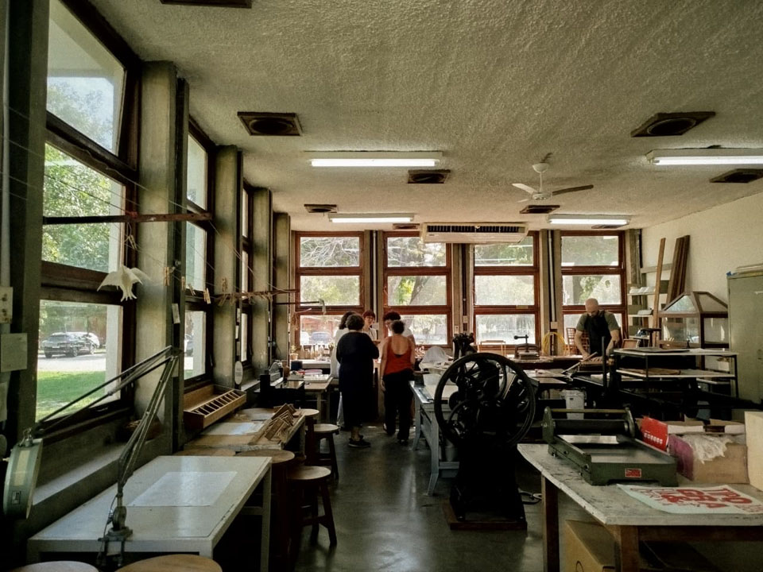

Numa sala esticada, pedaços de palavra são separados. É preciso separá-los porque juntos fazem som de nada. Ainda assim não há silêncio. Escuto o tintilar dos metais finos que se amassa no ruído verde e preto das árvores vizinhas. Estas palavras quebradas são ásperas, mas aprendi a medi-las com o toque. Febris, estão afligidas com o destino final: umas fadadas a morar em cardápios e outras hão de ser para sempre uma dúvida. Enquanto esperam a vez, vão deitar em potes vazios de margarina. 

_os potes plásticos sob a pia, 2025, fotografia de lyvia borges_

Caçoei dos costumes até serem meus. Vim trabalhar a troco de tempo. Conhecia pouco essa casa, seus enigmas de visita e os nomes de batismo dos objetos incógnitos que sempre respondiam a um chamado, saídos de uma gaveta topada. Importância para tudo. Diante da máquina maciça e oleosa, há lugar para os panos imundos, de uso qualquer. Há lugar para as tampas de potes sem potes e para os estiletes. Há lugar para conversas doces e esquecíveis.  

_os quadrados nos potes de margarina, 2025, fotografia de lyvia borges_

_estante com elementos brancos: entrelinhas nas prateleiras e quadrados nos potes, 2025, fotografia de lyvia borges_

_vista da oficina de tipografia, 2025, fotografia de lyvia borges_

Lyvia Borges é estudante de Licenciatura em Artes Visuais na Ufes e participou do projeto **ofício febril** em 2025-2.
