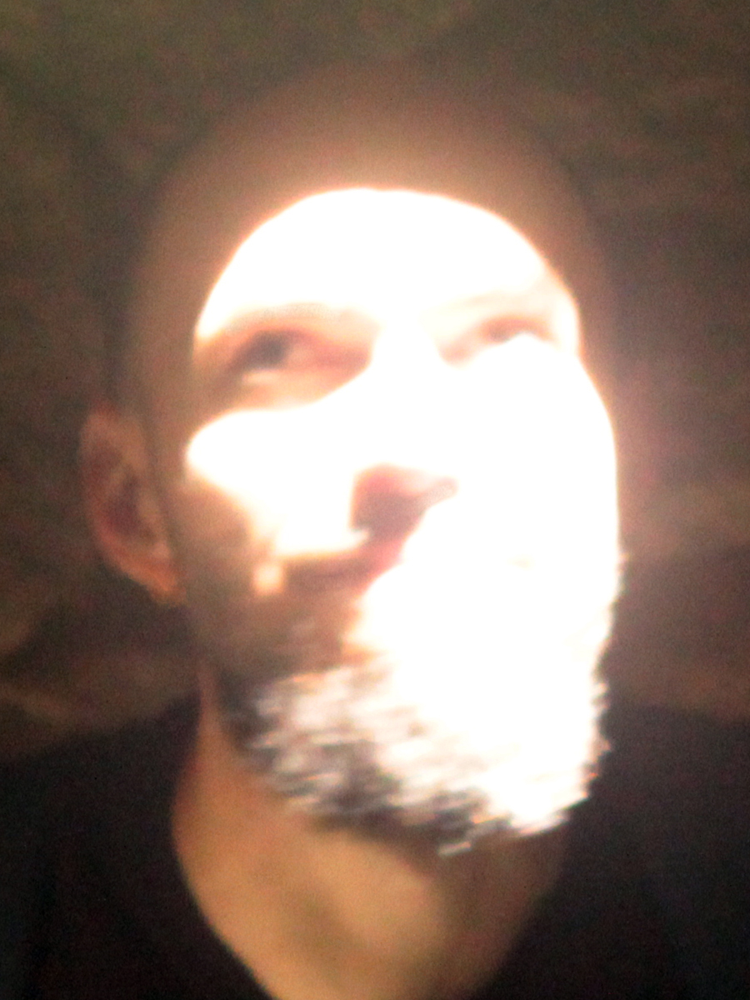

Coordenador do projeto **ofício febril** com Aline Dias.
Diego Rayck é artista e professor adjunto da Ufes desde 2016, com atuação prévia no ensino de artes em outras instituições e ênfase nas áreas de desenho e gravura desde 2004. A partir de 2009 integra a corpo editorial, grupo que se dedica a realizar exposições, filmes e publicações de artista. 
Também com Aline Dias coordena os projetos _escrita em artes_ (2017), _orquestra de desenho_ (2023) e _ofício febril_ (2025).

