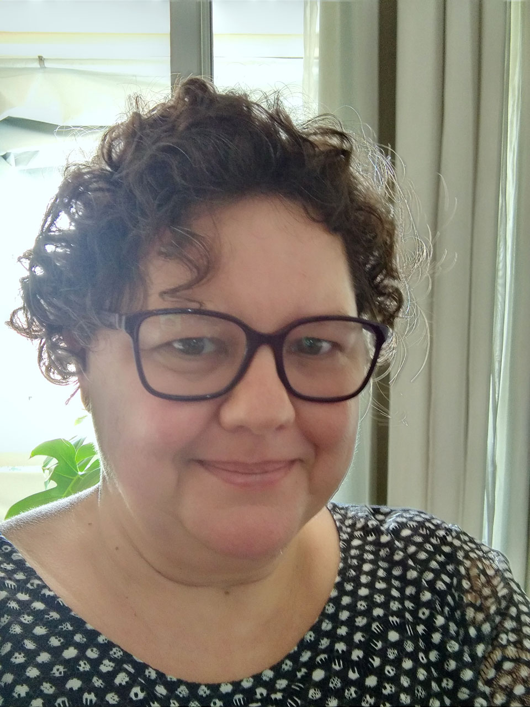

Pesquisadora participante do projeto de pesquisa **ofício febril** desde 2025.  
Desenvolveu o projeto de estudos programados *Desenho-tipo-mapa: imagens cartográficas e artísticas como intercessoras mútuas em âmbitos educativos* (Licença para Capacitação) no Laboratório de Tipografia e Litografia (DAV-CAR-Ufes), sob supervisão do Prof. Dr. Diego Rayck (2025/2).  
Geógrafa com Mestrado e Doutorado em Geografia pela USP e Pós-Doutorado em Educação pela Unicamp. Professora Titular da área de Cartografia no Departamento de Geografia do Centro de Ciências Humanas e Naturais da Ufes. Líder do Grupo de Pesquisa CNPq POESI - Política Espacial das Imagens e Cartografias e membro da Rede Internacional de Pesquisa *Imagens, Geografias e Educação?. 

