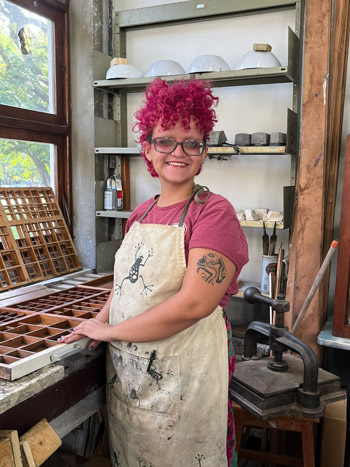

Integrante  da equipe do projeto **ofício febril** desde 2025.  
Estudante do curso de Bacharelado em Artes Plásticas UFES. É bolsista de iniciação cientifica com a pesquisa *Imagens do trabalho: a montagem fílmica como prática metamórfica nas produções de Harun Farocki* com orientação de Aline Dias. Também participa do projeto de extensão *escrita em artes*. 

_fotografia de Iolanda Calado_
