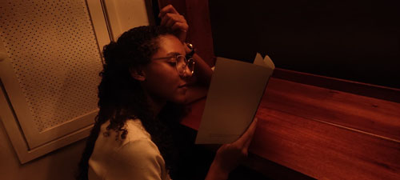

Jaks da Penha é graduada em Artes Plásticas e mestra em Educação pela Ufes. Sua produção se desdobra essencialmente no desenho articulando também com a escrita artística e a vídeo arte. Com interesse na paisagem, em especial a nuvem e a ruína, vem elaborando desdobramentos poéticos a partir desses elementos como prática de observação cotidiana. Artista residente do projeto _ofício febril: primeiras impressões_ (2025-2/2026-1).

_artista na exposição *pão ganha-pão*, 2024_
