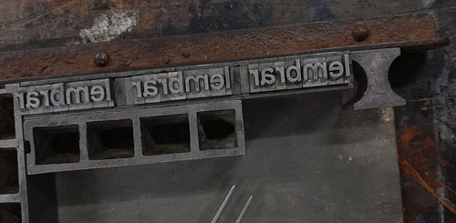
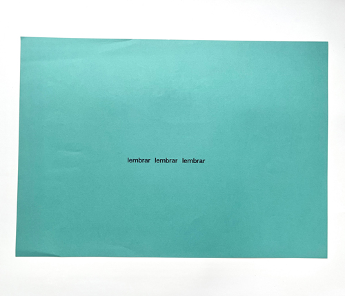
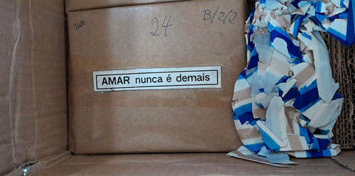


O cartaz é dedicado ao artista, professor e amigo marcos martins falecido em setembro de 2025. A palavra lembrar, repetida três vezes, foi composta com tipos móveis comprados da hoje extinta Tipomagraf de Belo Horizonte e impressa no final de 2025, com a lembrança carinhosa e dolorida da presença de marcos na oficina.  
Tiragem de 12 exemplares, sentindo sua falta. Produzido no contexto do projeto *ofício febril: primeiras impressões*.

_aline dias, *lembrar lembrar lembrar*, 2025, detalhe da composição com tipos móveis_

_aline dias, *lembrar lembrar lembrar*, 2025, cartaz para marcos martins_

_os tipos móveis embalados, recém chegados na oficina. Foto de aline dias_

