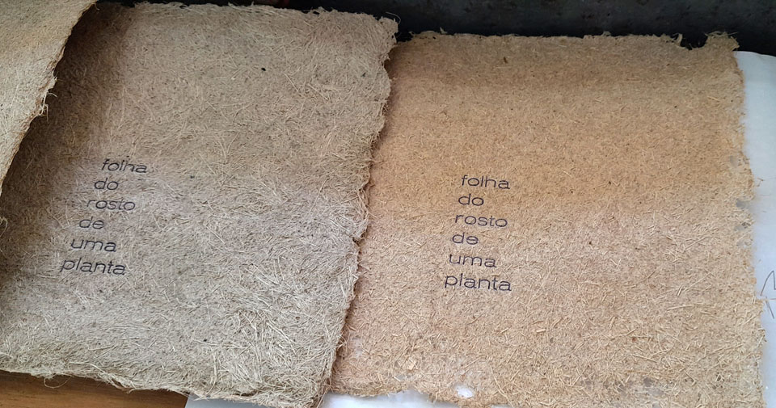
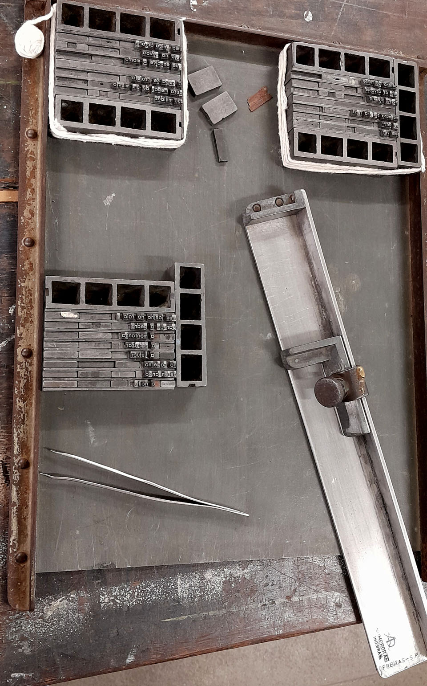
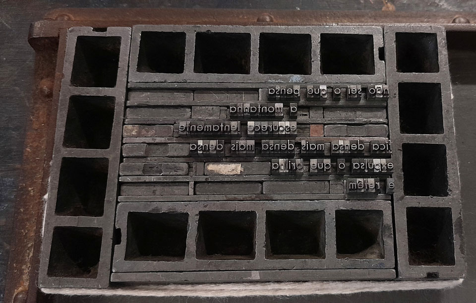
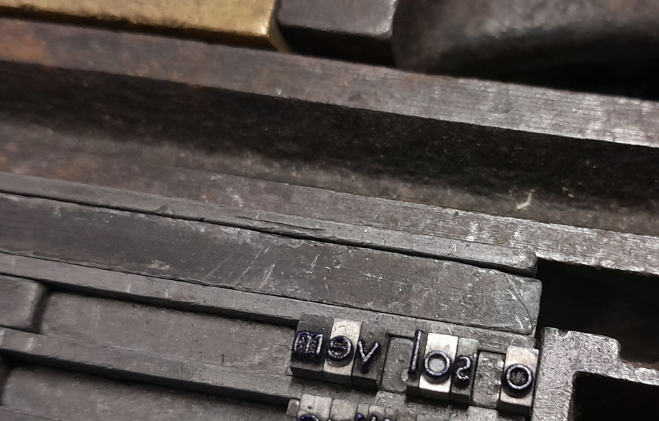
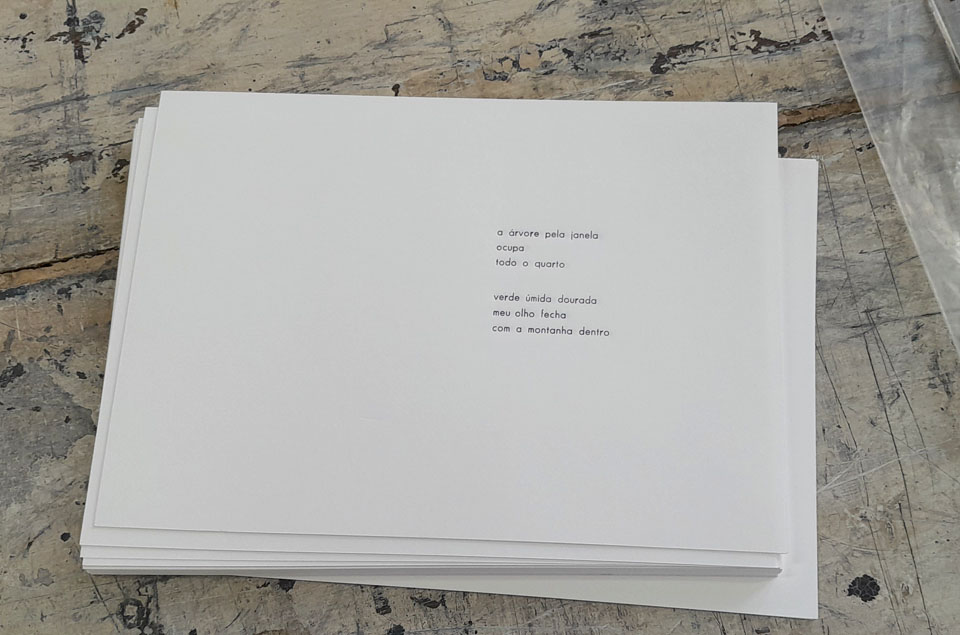
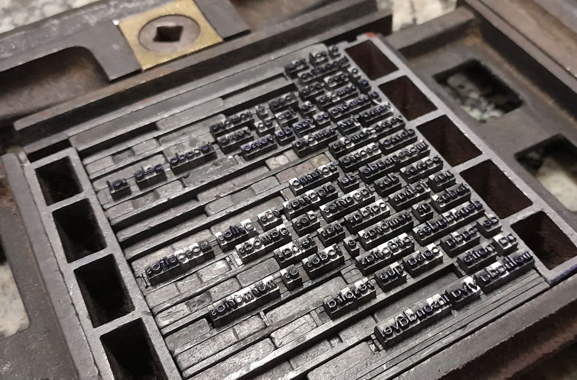
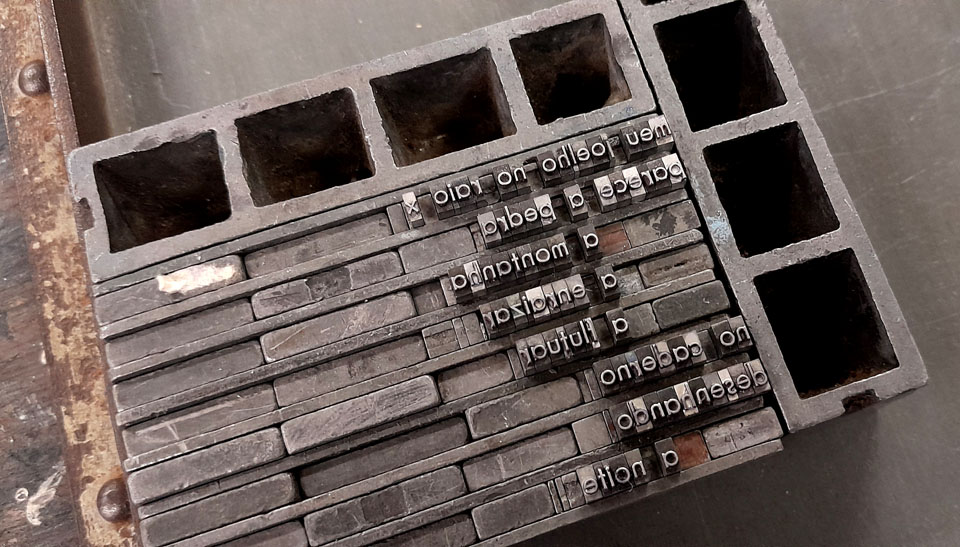
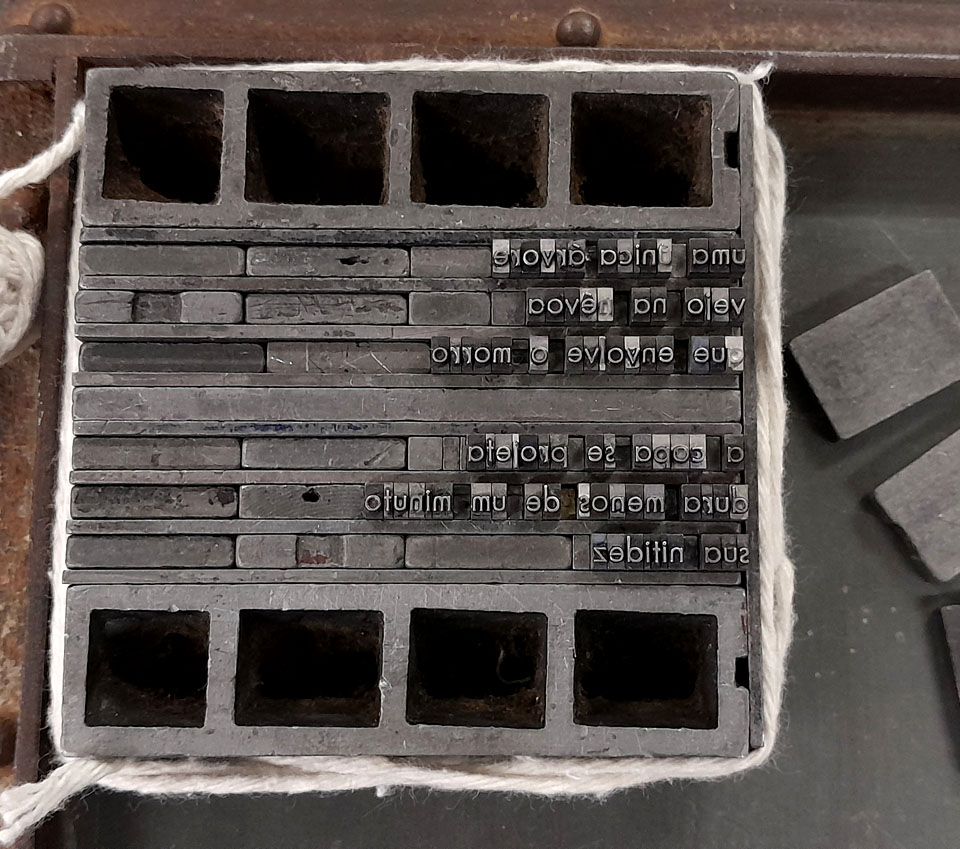

import { Vimeo } from "astro-embed"

a publicação _folha do rosto de uma planta_ compreende oito poemas compostos com tipos móveis e impressos pela artista aline dias na prensa manual pérola. a proposta é que o miolo seja acolhido por uma capa, também com impressao tipográfica, sobre papel de bananeira, boldo e espada, especialmente produzido por daniel souza para o trabalho.

_aline dias, **folha do rosto de uma planta**, 2026, imagens de processo_

<figure>
  <Vimeo id="https://vimeo.com/1178015621?share=copy&fl=sv&fe=ci" />
  _aline dias, encontrando o ritmo no processo de impressão com a prensa manual
  pérola, março de 2026 (gravado por diego rayck)_
</figure>

_aline dias, **folha do rosto de uma planta**, 2026, processo: 3 poemas na boiadeira_

_aline dias, **folha do rosto de uma planta**, 2026, processo: detalhes da composição_

_aline dias, **folha do rosto de uma planta**, 2026, processo: algumas páginas impressas_

_aline dias, **folha do rosto de uma planta**, 2026, processo: detalhes da composição_