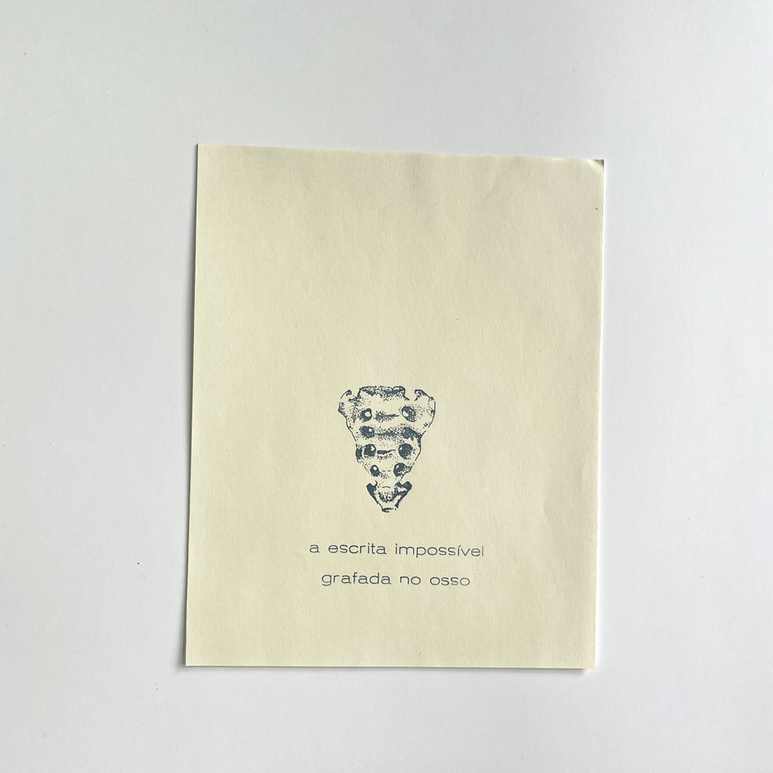
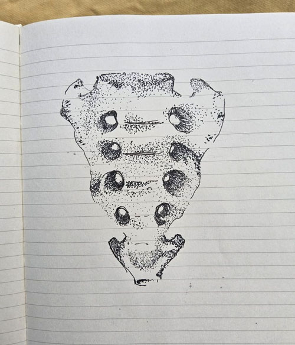
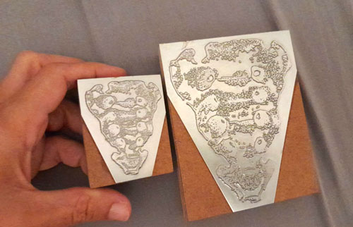
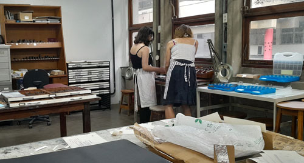
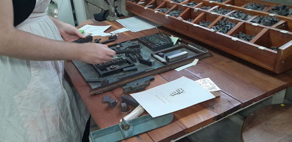


Durante sua licença capacitação Ana Lucia Vilela desenvolveu esta composição com clichê e tipos móveis

_Ana Lucia Vilela, *a escrita impossível grafada no osso*, composição e impressão tipográfica, foto de isabella da campos_

_imagens de processo, desenho, clichês e vistas da artista na oficina_

