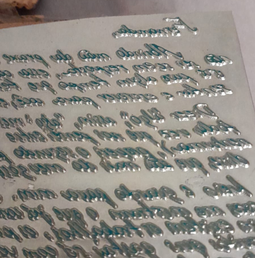

A Carta-clichê tem sua origem em uma carta previamente escrita pela artista e que foi transformada em um clichê tipográfico.  
Os clichês tipográficos são matrizes de metal em relevo que, com aplicação de tinta, transferem uma imagem, ou texto, para uma superfície de impressão. Dessa forma, permitem que seu conteúdo seja replicado à exaustão ou até que a deterioração da matriz, por seu tempo e uso contínuo, a torne inutilizável.  
Por outro lado, uma carta clichê, sem hífen, faz uso de expressões já por muito tempo utilizadas, chavões discursivos e ideias derivativas. Sejam aquelas presentes nos manuais epistolares, ou aquelas movidas pelo pieguismo generalizado dos amantes, as cartas clichês carregam consigo a certeza de uma mensagem previsível.  
Ao recusar a destinação comum do suporte tipográfico e abnegando-se à carta o portal de transmissão de uma mensagem organizada discursivamente, a **Carta-clichê** tensiona o exercício do olhar e formas outras de se relacionar com sua estrutura.

_ciudad sin sueño, *carta-clichê*, 2025-26_

