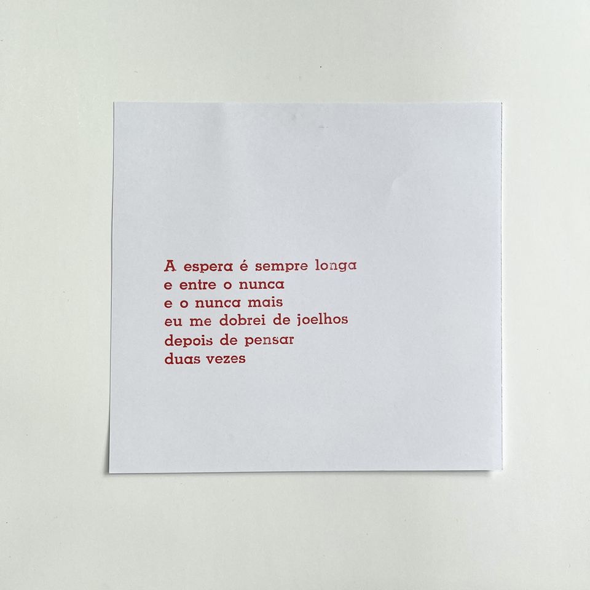

Fragmento de poema impresso em tinta vermelha com fonte Memphis. Exercício de deslocamento e serialização de poesia escrita para o papel, desenvolvido no ateliê de impressão tipográfica no contexto do projeto *ofício febril: primeiras impressões*.  
O fragmento trata da dubiedade da espera.

_CiudadSinSueño, *A espera é sempre longa...*, 2025, composição e impressão com tipos móveis. fotografia de Isabella de Campos_

