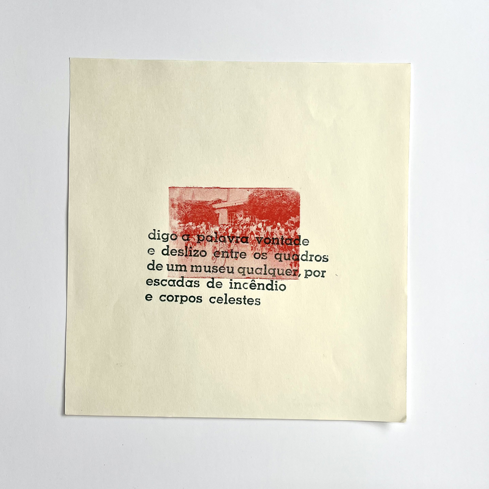

O trabalho partiu de um exercício de tensionamento de imagem e texto realizado em oficina com Cristiano Moreira, da Oficina Tipográfica Papel do Mato (Rodeio, Santa Catarina) junto do projeto *Ofício Febril: primeiras impressões*.  
O pequeno fragmento de poema, impresso com fonte Memphis em verde, se sobrepõe a um clichê tipográfico antigo e sem autoria conhecida, que retrata um bando de ciclistas avançando no espaço público e sobre o poema.

_CiudadSinSueño, *Digo a palavra vontade...*, 2025, impressão com tipos móveis e clichê. fotografia de Isabella de Campos_

