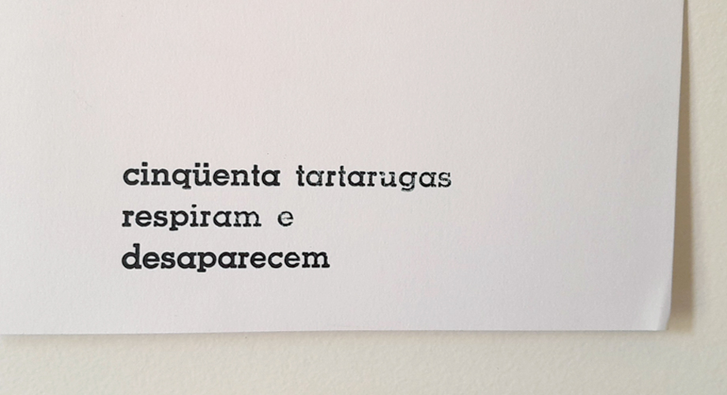
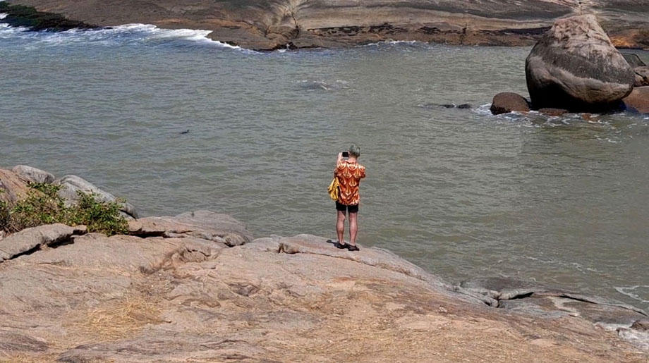

_caetano gotardo, *cinqüenta tartarugas*, 2024, composição com tipos móveis, 14,8 x 21 cm, fotografia de isabella de campos_

o cineasta caetano gotardo visitou a oficina em setembro de 2024. Determinado a usar a trema, compôs um poema que foi impresso por aline dias em outubro.  
as tartarugas que aparecem na sua composição, utilizando a fonte memphis, corpo 20 pontos, aparecem também no seu filme *uma montanha em movimento*, 2025, filmadas nesta mesma manhã de setembro, na praia das castanheiras, na ilha do frade, integrante da área de preservação ambiental baía das tartarugas, em vitória.

_caetano gotardo filmando na baía das tartarugas, 2024, fotografia de aline dias_
