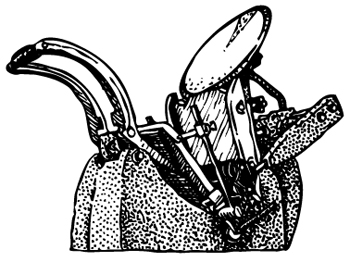


Este impresso tem como elemento principal um dos equipamentos centrais do laboratório, a prensa Adana 5x8. Ao desenhá-la é impressionante como as formas concisas de sua base acabam se tornando um desafio de detalhes e proporções na medida em que parte de seus mecanismos ficam fora do envoltório externo vermelho.  
Nesta imagem gostaria de evidenciar, além do design do equipamento, essa característica que foi sendo progressivamente suplantada em máquinas recobertas por carapaças inteiriças que escondem seus componentes.  
Clichê e impressão desenvolvidos no contexto do projeto *ofício febril: primeiras impressões*.

_diego rayck, *adana*, 2026, impressão tipográfica de clichê. desenho do artista_
