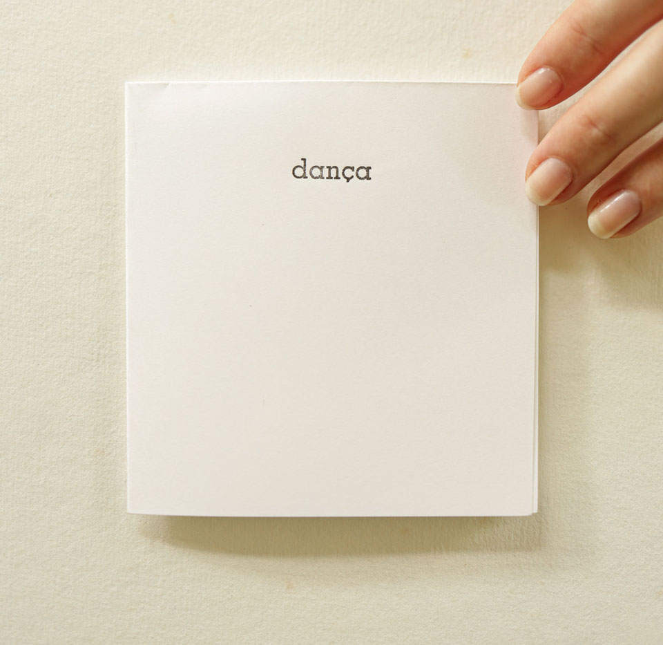
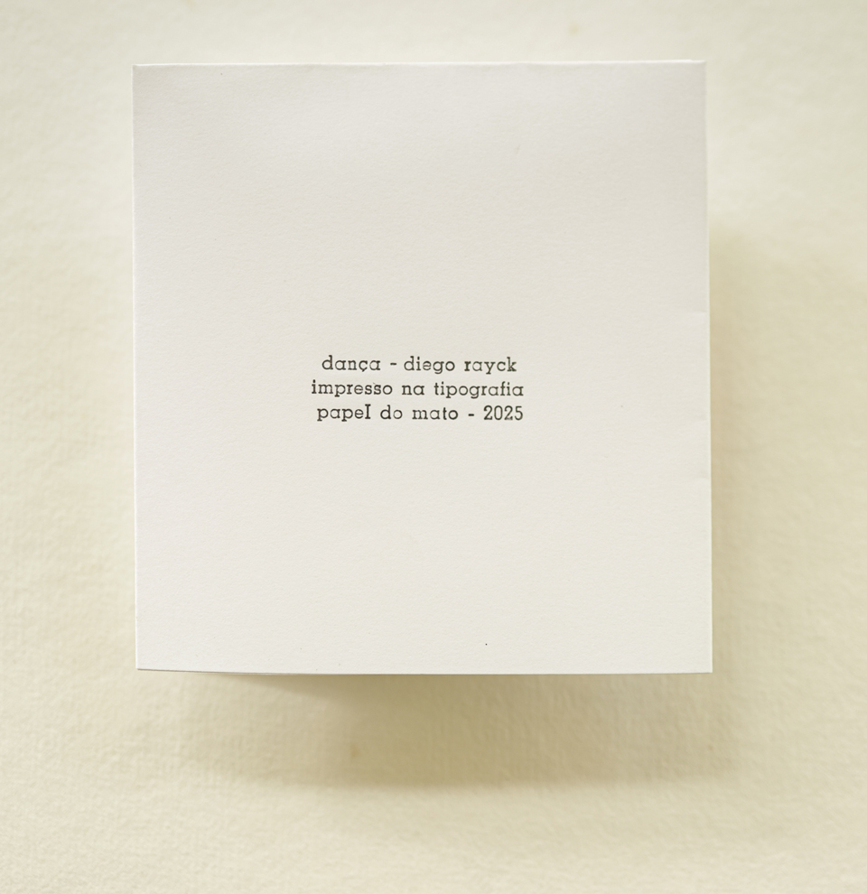


Esta publicação retomou um conjunto de estudos em xilogravura realizados em torno do ano de 2008, sendo algumas impressas e outras permanecido como matrizes parcialmente gravadas. A ideia partiu da dança do ator Christopher Walken para o vídeo da música *Weapon of Choice*, mas na figura do personagem Max Schreck interpretado pelo ator anos antes.  
A ideia era explorar a sequência de algumas estampas de um dançarino que insistisse em sua performance enquanto ela despedaçasse seu próprio corpo.  
Como resultado, pareceu melhor que, ao invés de uma série maior demonstrando este esforço, apenas 3 imagens conferissem pela rapidez do processo uma característica patética à figura.  
A impressão aconteceu na oficina tipográfica Papel do Mato em 2025.


_diego rayck, *dança*, 2025, capa da publicação, impressão de tipos móveis. fotografia de catarina altoé_

_diego rayck, *dança*, 2025, detalhe do miolo da publicação, entreaberta, impressão de clichê. fotografia de catarina altoé_

_diego rayck, *dança*, 2025, colofão da publicação, impressão de tipos móveis. fotografia de catarina altoé_
