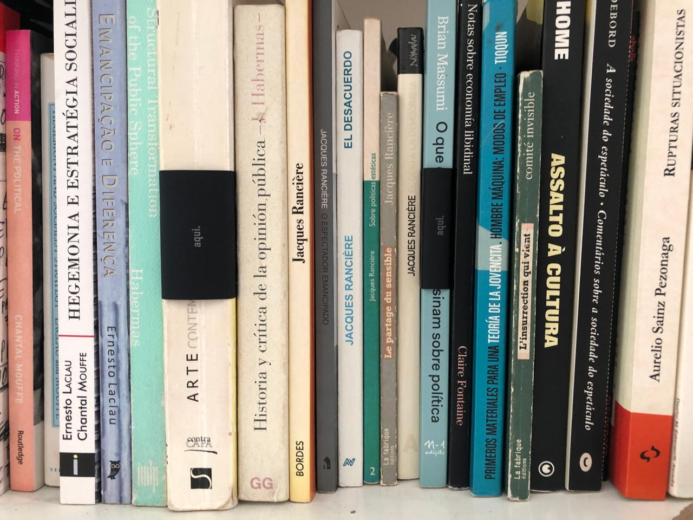
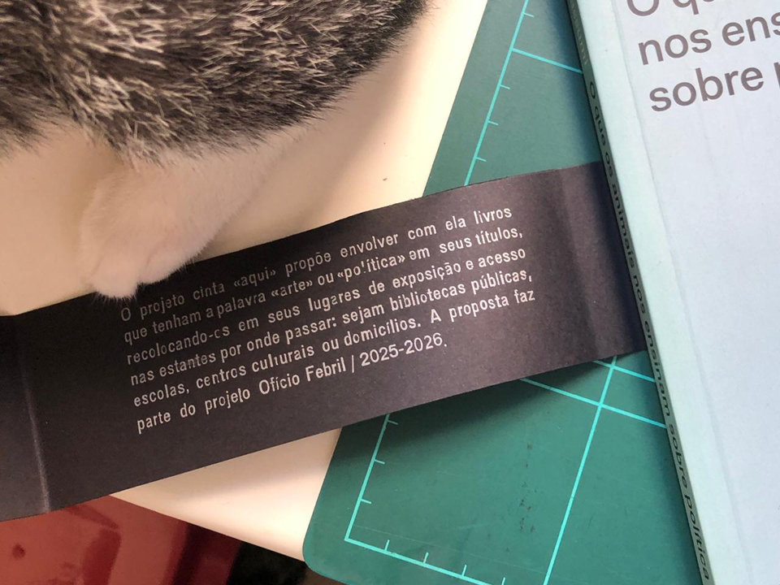
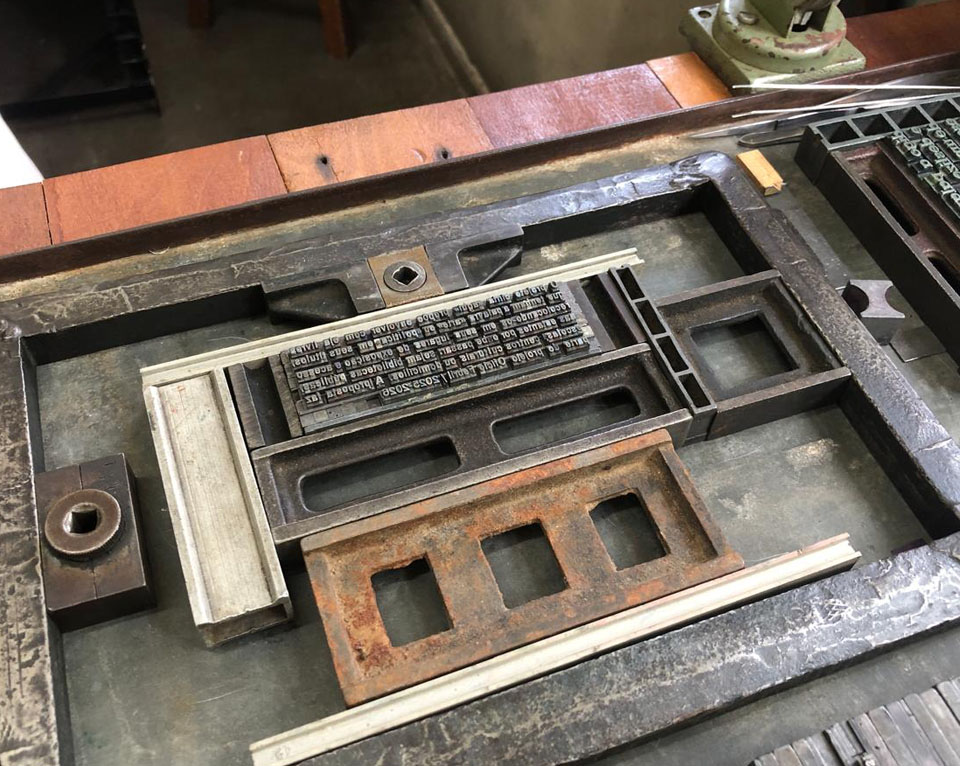
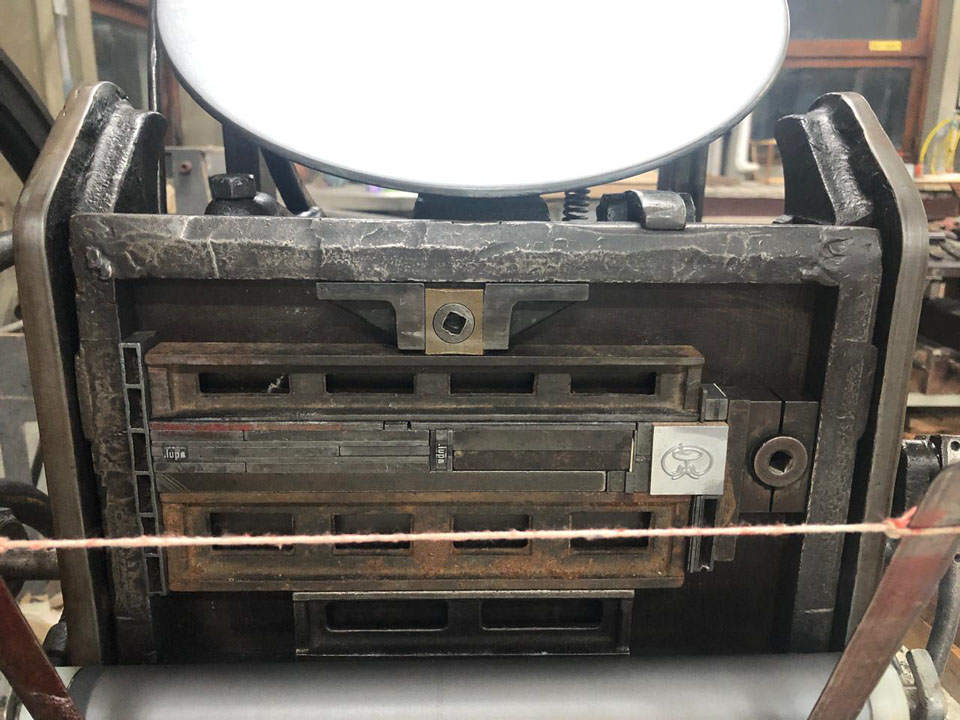
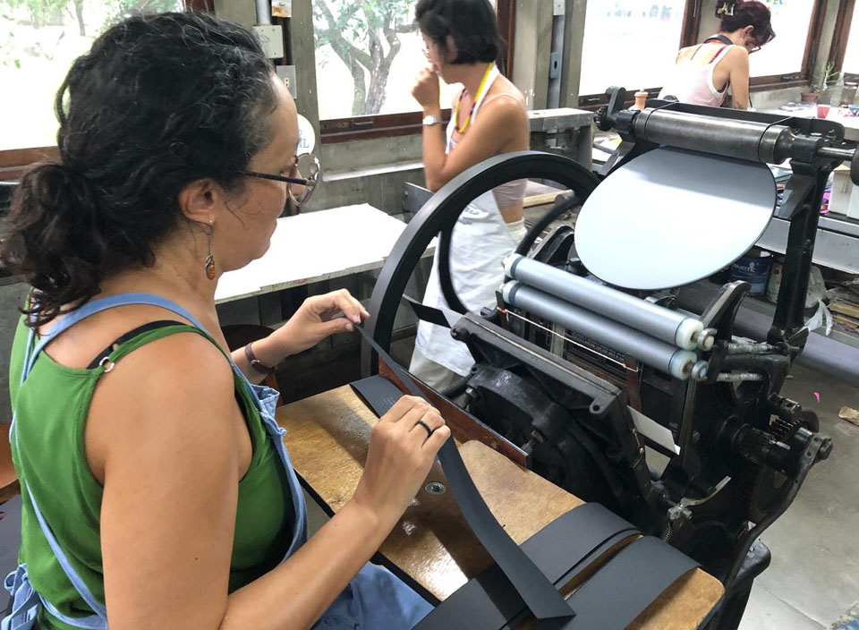
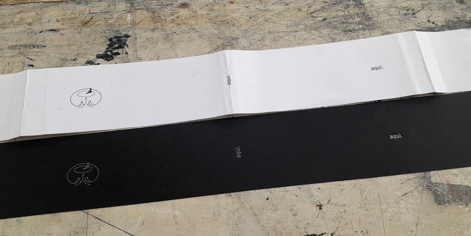

Como parte do projeto *Ofício Febril: primeiras impressões*, o projeto cinta “aqui” responde a uma provocação feita a um grupo de artistas, instigando-os à ação artística voltada para a publicação. A partir da sede do projeto – a oficina tipográfica, criada e bravamente mantida pela dupla Aline Dias e Diego Rayck, na sala 6 do Departamento de Artes Visuais da Ufes –, a proposta instiga à prática artística em proximidade com os tipos móveis.  
Propomos, então, a confecção de uma cinta em tiragem suficiente para envolver diferentes livros que façam parte de bibliotecas diversas, abrigadas por instituições por onde o projeto *Ofício Febril: primeiras impressões* deverá circular. A cinta, em papel preto (colorplus 120g/m2), traz a impressão (tipográfica) da palavra “aqui” em dois lugares (frente e lombada) em tinta prata.

Ao ser colocada em qualquer livro que traga a palavra “arte” ou “política” em seu título, a cinta pretende convocar uma atenção específica à publicação como lugar (“aqui”) atravessado pela dimensão política da arte. Os tipos móveis utilizados em sua produção trazem a marca histórica da reprodutilibidade técnica que acompanha o desenvolvimento da noção de “público”, que, inseparável de uma perspectiva política, tensiona a arte enquanto publi-ação. A cinta produz também um efeito “tarja preta” sobre os livros, aludindo ao potencial psicotrópico de qualquer leitura, seja ela transgressora ou conservadora.
Cabe também entender o projeto como uma aproximação ao trabalho Caminhando (1963) de Lygia Clark, o que permite pensar em possíveis ações sobre a cinta, caso o leitor se sinta movido a também caminhar por ela.  
Gisele Ribeiro 

_Gisele Ribeiro, *projeto cinta "aqui*, 2025, imagens do processo de impressão tipográfica na oficina. fotografias da artista_

