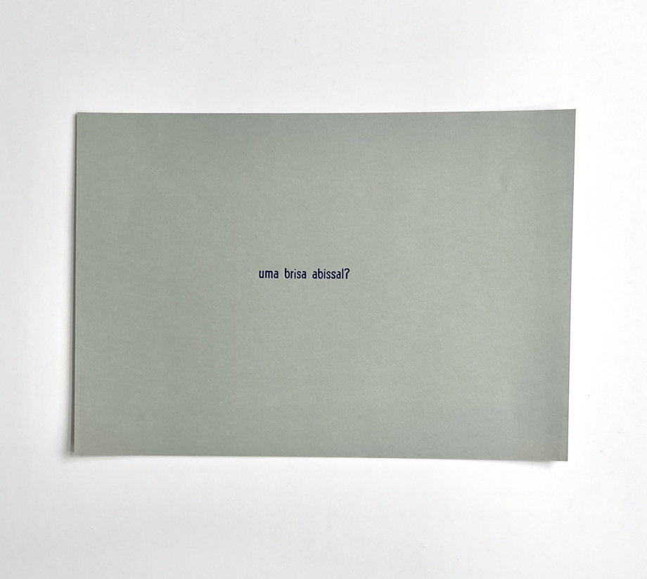

 

Escrevi esta frase à caneta no dia 10 de setembro de 2025, em um caderninho marrom que levei comigo em uma visita ao museu Inhotim. Fiquei um bom tempo na sala do *Sonic Pavilion*, do Doug Aitken, e tentava escrever e pensar sobre os sons que eu escutava, da obra e dos visitantes. Foi assim que apareceu “uma brisal abissal”, mas ainda sem o ponto de interrogação.

Duas semanas depois, a frase acompanha a vida que se transforma e é compartilhada. A frase ganhou forma em pequenos tipos de chumbo, e o peso do metal não encerra a frase de forma afirmativa, ela acaba ganhando o sinal de interrogação, algo ainda maleável.

_herbert baioco, *uma brisa abissal?*, 2025, composição e impressão tipográfica, 14,8 x 21 cm, foto de isabella de campos_

no dia 24 de setembro de 2025 a prensa tipográfica manual pérola teve sua re-estréia no século xxi. a frase composta por herbert baioco com a fonte kabel, corpo 24 pontos foi a primeira impressão depois de tantos anos parada e de um ano de restauro desenvolvido por diego rayck com apoio de guilherme schmittel.  
a composição: *uma brisa abissal?* marcou esse movimento de retorno da prensa tipográfica manual ao seu ofício. a impressao foi feita por aline e herbert, que esteve na oficina também gravando os sons da impressão tipográfica com um microfone de contato.  
a brisa que é a presença do herbert na oficina, o abissal da pele na exposição de marcos martins, marcou também o luto que compartilhamos. 

