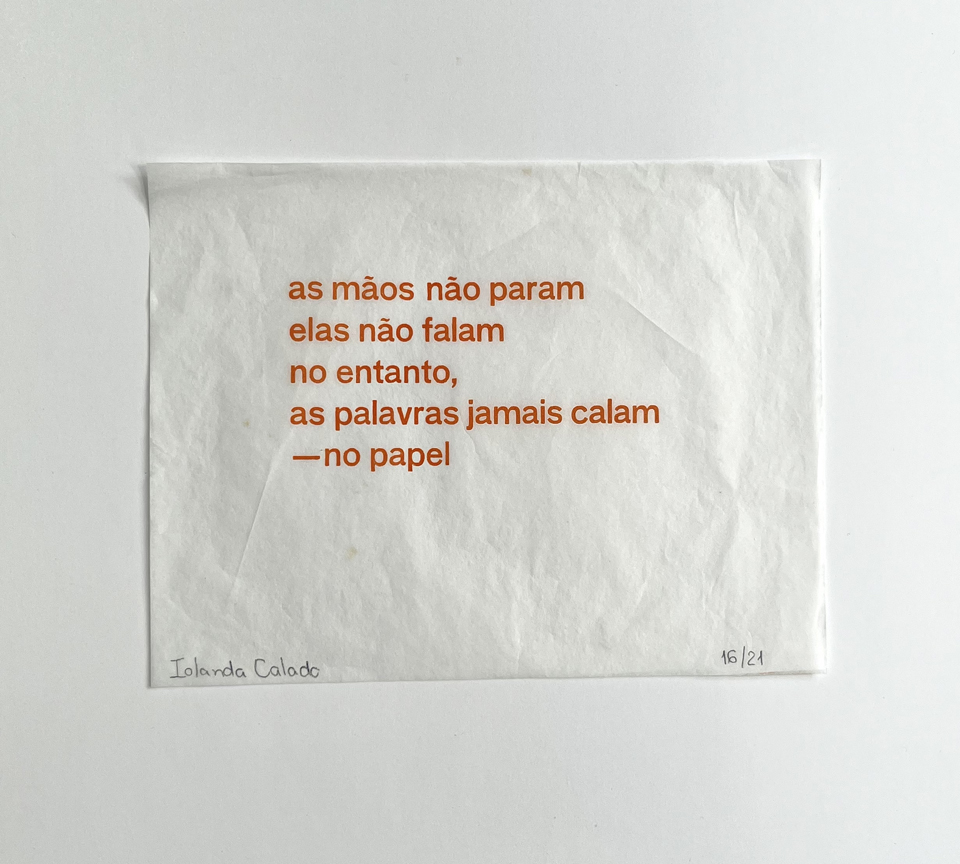
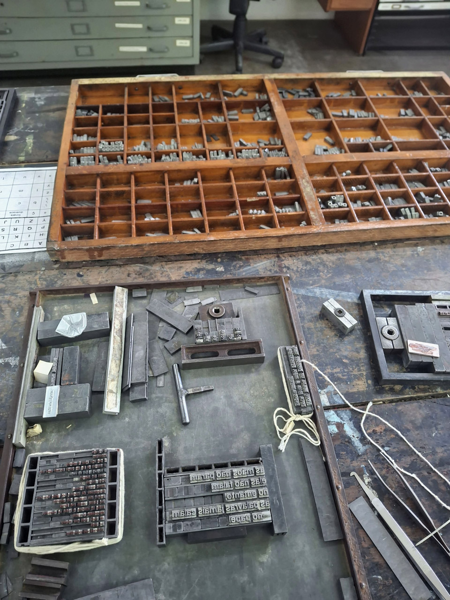
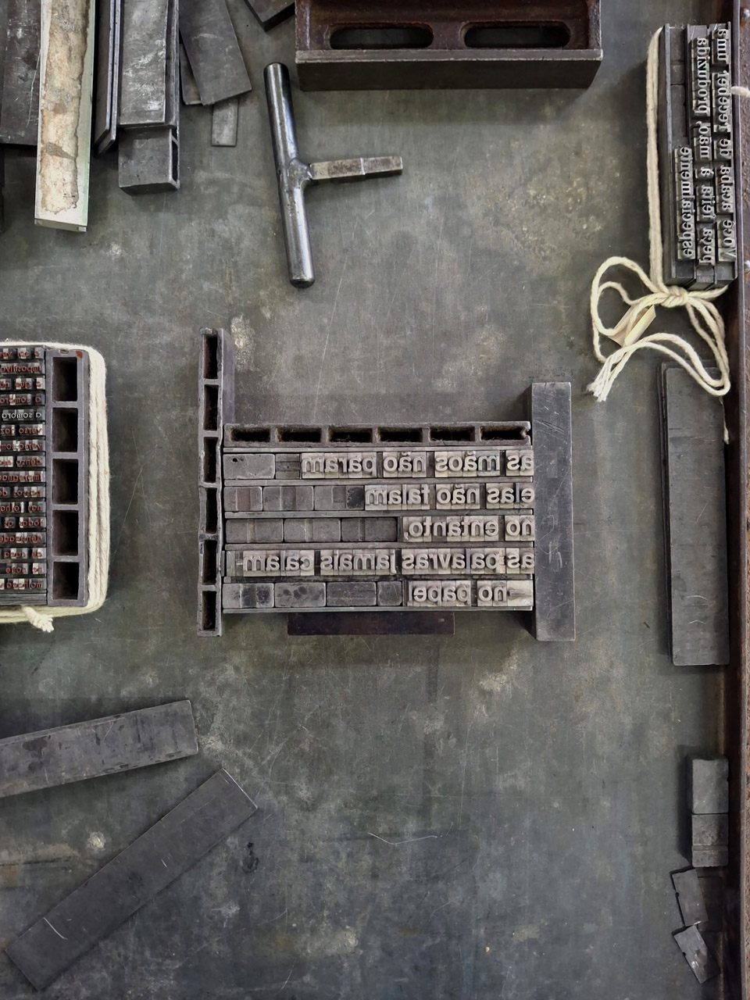
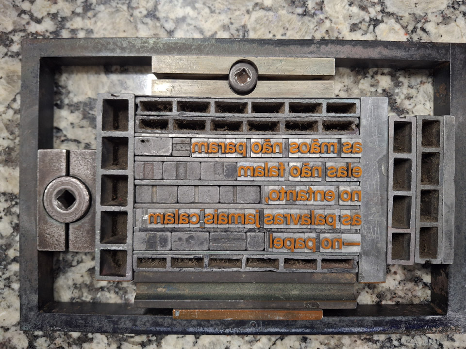
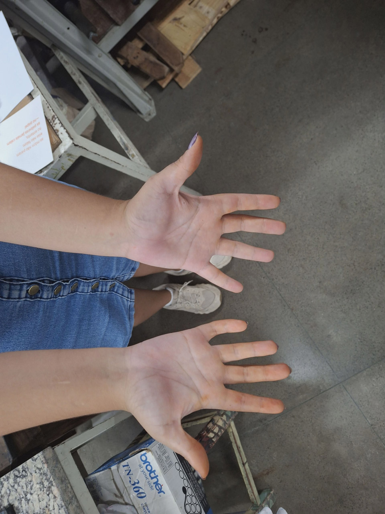
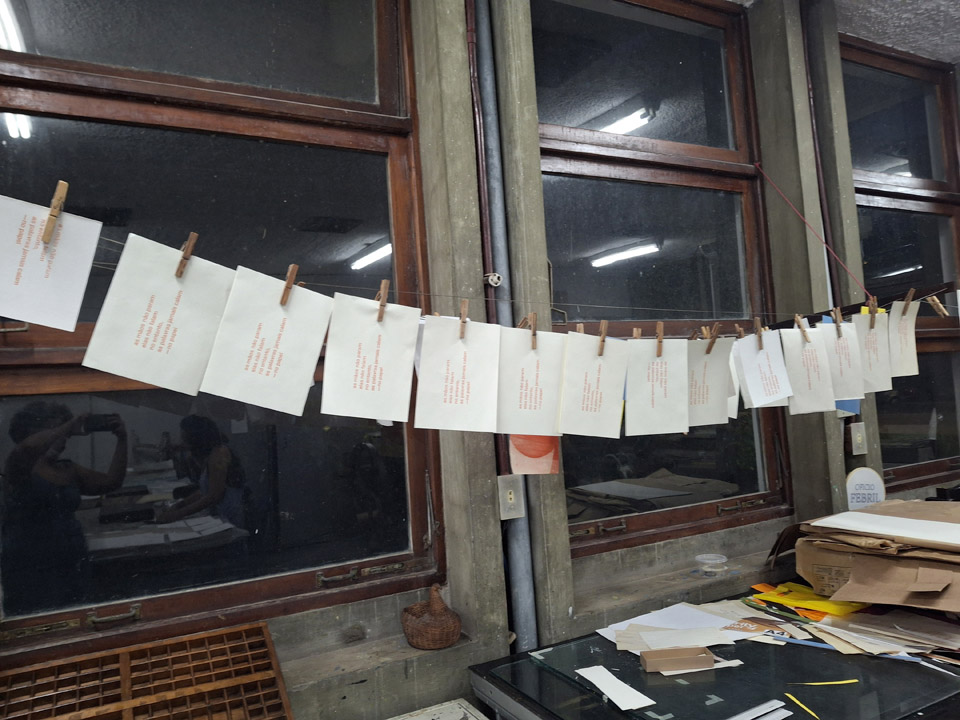
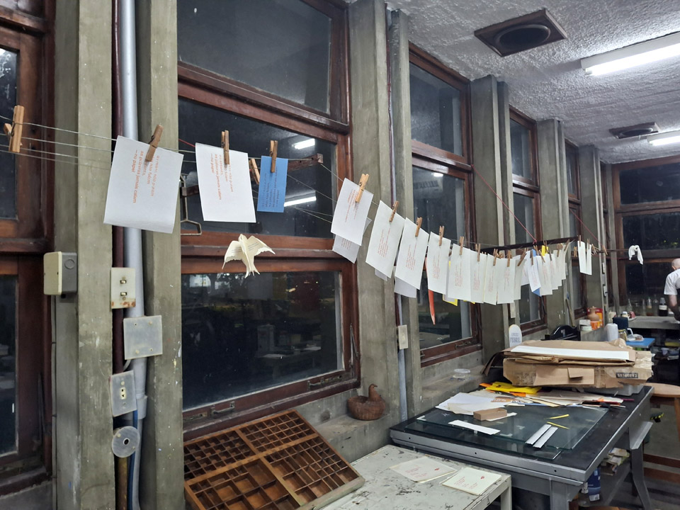
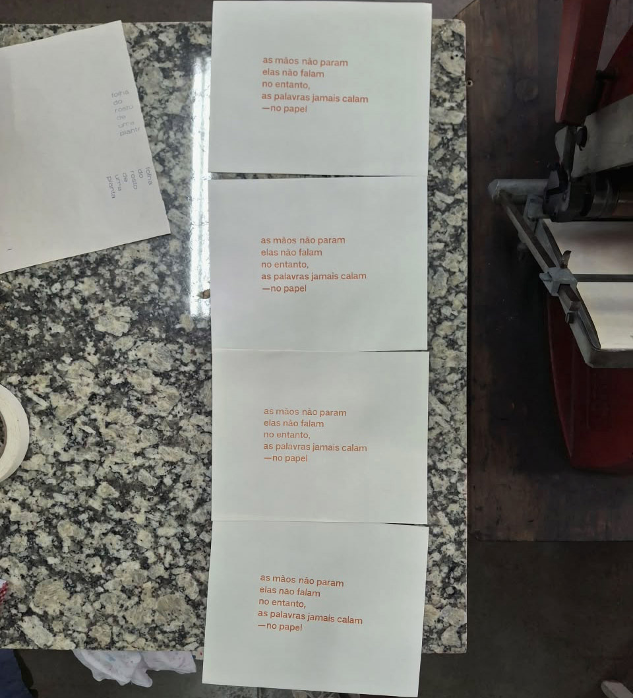

_Iolanda Calado, **as mãos não param**, 2026, impressão tipográfica_

Essa impressão surge do texto [as mãos não param](https://www.oficiofebril.com.br/a-oficina-e-o-oficio/iolanda-maos/), relato pessoal de experiência, no qual a artista enfatiza o trabalho das mãos no cotidiano da oficina de tipografia, relacionando sua experiência individual à coletiva.  
O processo de impressão contou com o auxílio de Aline Dias e Diego Rayck e o apoio de Guilherme Schmittel.  

  
  
   
  
  
  
  
_Iolanda Calado, **as mãos não param**, 2026, imagens do processo, fotografias da artista_

