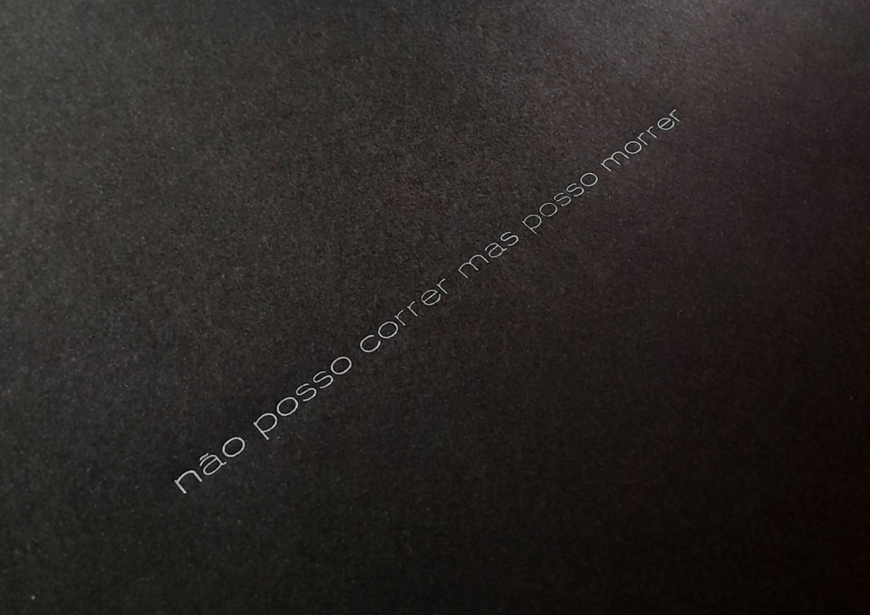
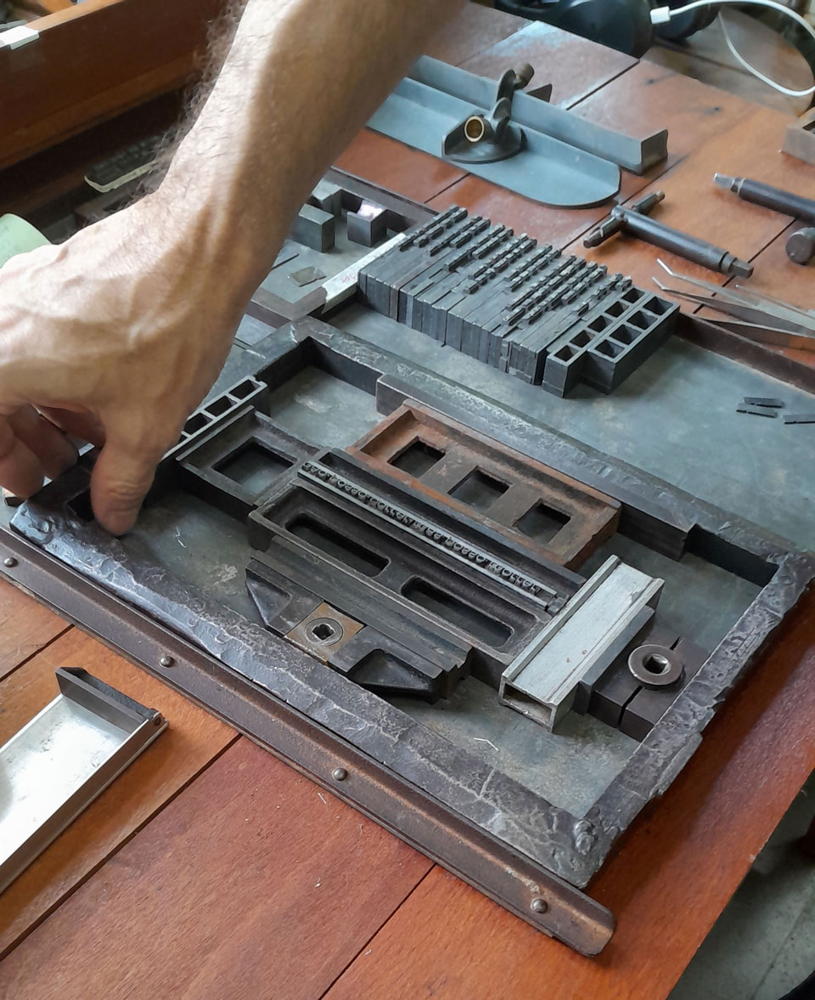
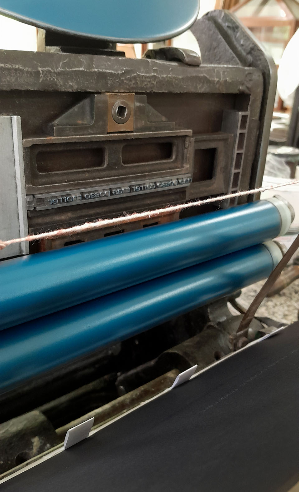

Não posso correr, mas posso morrer é um poema proposto para expor a violência que nós, pessoas negras, passamos cotidianamente pelo racismo. Não correr livremente significa uma ação pensada para resguardar a si, uma tentativa de não ser lida como uma pessoa suspeita por causa da invisível política de discriminação que julga corpos negros como ameaça constante.  
A contradição do “não poder correr”, isto é, de ter a liberdade constitucional colocada em risco, é suprimida pelo “poder morrer” que foi institucionalizado pelo racismo que interrompe de inúmeras formas a vida de pessoas negras. A obra explora a representação num sentido literal e também a compreensão metafórica por poder acionar outras violências desencadeadas não apenas pelo ato de correr.  
Em 2024 a primeira versão impressa da obra integrou a exposição coletiva itinerante _papel de parede_ com a curadoria de Gabi Bresola e Marcos Walickosky. Na mostra, o poema foi impresso a partir do arquivo digital com letras em preto, caixa alta, sobre papel branco.  
Para este projeto escolhemos imprimir tipograficamente sobre papel preto com tinta azulada, nos forçando a desempenhar um olhar mais acurado para apreensão do escrito. A fonte escolhida, grotesca larga clara, também confere ao poema, talvez de forma irônica, uma delicadeza inesperada dada pelas suas curvas finas.

_jaks da penha, *Não posso correr, mas posso morrer*, 2026, detalhe_

_jaks da penha, *Não posso correr, mas posso morrer*, 2026, processo: composição na rama_

_jaks da penha, *Não posso correr, mas posso morrer*, 2026, processo: impressão na prensa manual tipográfica_
