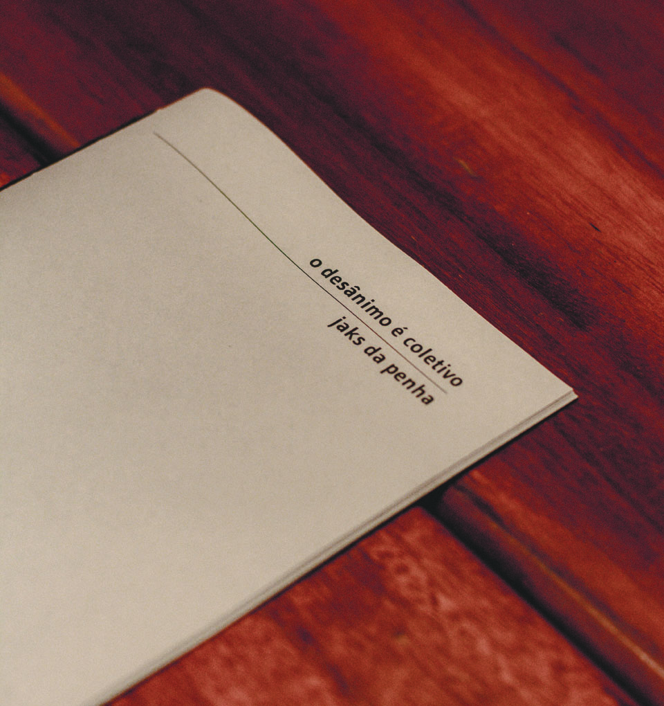

A publicação **O desânimo é coletivo** inclui os textos _IV. O desânimo é coletivo: o que resta do desânimo_ e _V. O desânimo é coletivo: idas e vindas no busão_, que integram uma série de crônicas iniciada em 2020. Os textos abordam o trabalho e o meu deslocamento na cidade, na época como estudante-bolsista em um espaço artístico institucional, intercalando observações sobre a rotina de funcionárias terceirizadas na universidade e de trabalhadoras domésticas com quem compartilhei o transporte coletivo durante o trajeto diário. Foram publicados inicialmente no blog do projeto _escrita em artes_ em 2022 e uma primeira versão impressa foi apresentada na exposição _pão ganha-pão_ em 2024. Esta é a segunda edição da publicação O desânimo é coletivo, que mantém o projeto gráfico de Aline Dias, composta com a fonte Gudea, impressa a laser em papel color plus milano 85g foroni e costurada manualmente em 2026 no contexto do projeto _ofício febril: primeiras impressões_.

_jaks da penha, *o desânimo é coletivo*, 2024-26_
