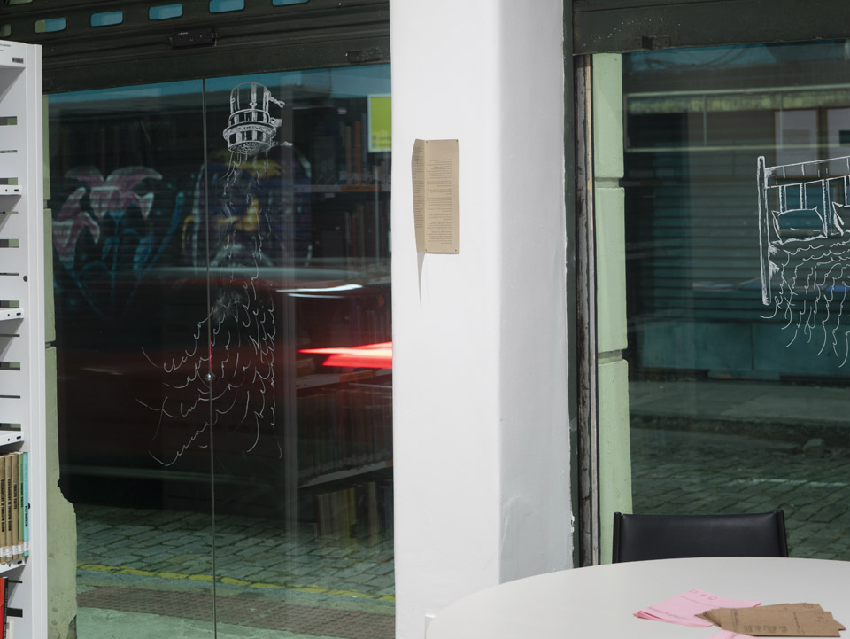
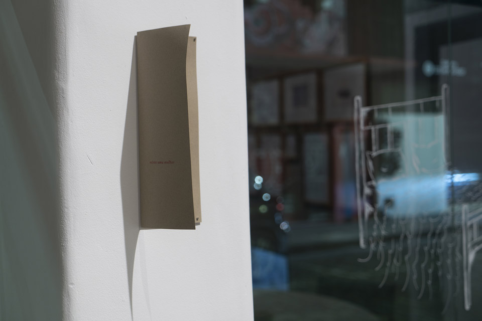

_jessica sampaio, **Existe uma mulher**, 2026, impressão laser e carimbo_

**Existe uma mulher** nasce de um exercício de escrita de imaginação desenvolvido durante o processo de construção narrativa e de montagem de um filme. Inicialmente concebido como ferramenta de criação para orientar percursos, atmosferas e possibilidades de edição audiovisual, o texto desloca-se posteriormente para o espaço expositivo, assumindo autonomia como obra.  

A narrativa acompanha uma mulher guardiã do mangue em seu percurso cotidiano por uma paisagem atravessada por matéria, memória e temporalidades sobrepostas. Entre o trabalho de captura do caranguejo-uçá, os sons do território e o encontro inesperado entre tecnologias ancestrais e digitais, a escrita constrói uma figura situada entre múltiplas existências possíveis: marisqueira, testemunha, trabalhadora, fotógrafa.  

O trabalho mobiliza a imaginação como procedimento de aproximação entre corpo, território e arquivo. O mangue surge como cenário e espaço vivo de disputa, permanência e produção de memória. Ao transitar entre a linguagem literária e o pensamento audiovisual, o texto opera como uma espécie de roteiro expandido: uma escrita que procura visualizar imagens antes mesmo de existirem, elaborando cenas, ritmos e gestos que permanecem em suspensão entre a realidade e a fabulação.  
 
