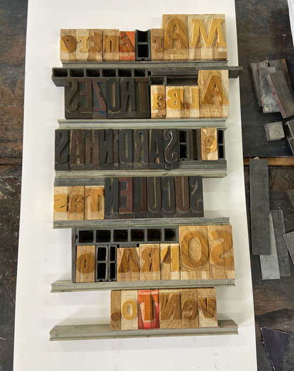
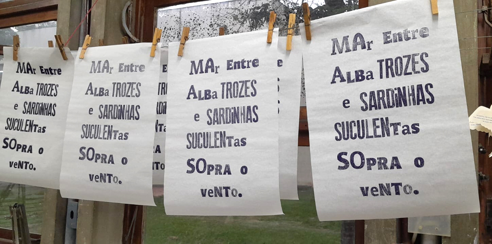
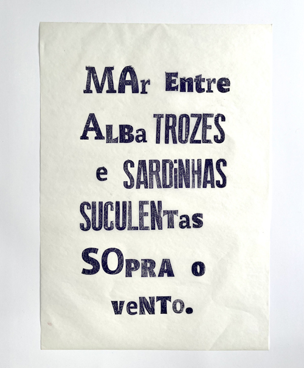

a composição desenvolvida em dezembro de 2025, utilizou os tipos de madeira do acervo do Laboratório de Gravura DAV UFES, guardados e cedidos pelo professor Fernando Gomez e os novos tipos de madeira especialmente produzidos com recursos do projeto *ofício febril: primeiras impressões*. Os novos tipos foram desenvolvidos por Nicolas Camargo, da  [Experimento gráfico](https://https://experimentografico.com.br/type-graphic-design-page-4/), de Pouso Alegre, a partir da fonte *ponta wood black*  de Ricardo Esteves.  

_natanael de souza, *mar entre*, 2025-6, processo de composição com tipos móveis de madeira, foto do artista_

A impressão foi feita em papel manteiga por Letícia Marinato, com apoio de Iolanda Calado, integrantes da equipe do projeto **ofício febril** no começo de 2026, com o prelo tira provas comprado da hoje extinta Tipomagraf, com o senhor Arimatéia, de Belo Horizonte.

_natanael de souza, *mar entre*, 2025, processo de impressão na oficina_ 

_natanael de souza, *mar entre*, 2025, composição e impressão com tipos móveis de madeira, 30 x 42cm, foto de Isabella de Campos_

