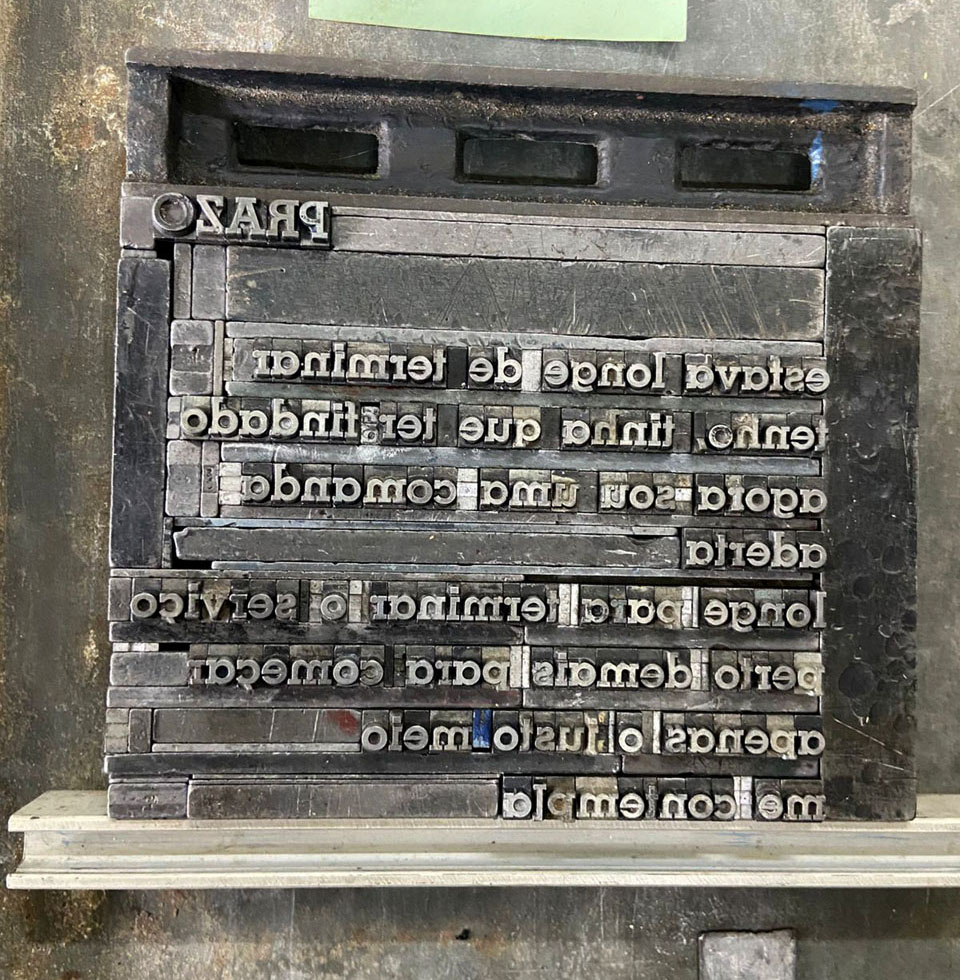
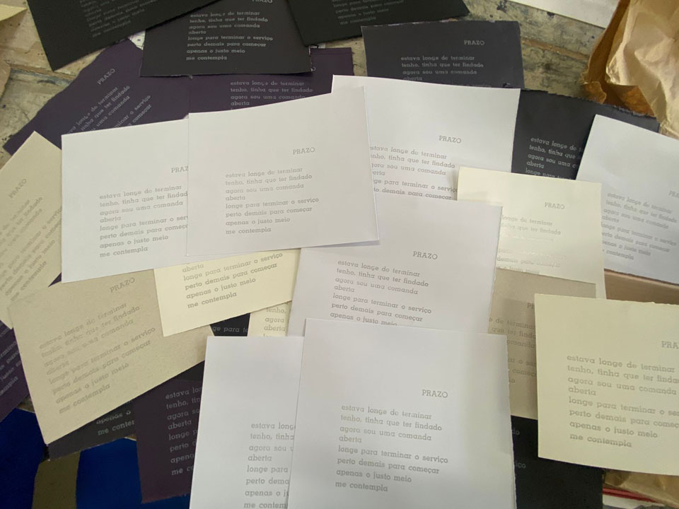


Durante o workshop com a equipe da oficina tipográfica papel do mato, Natanael Souza desenvolveu duas composições com tipos móveis. A primeira, *prazo*, utilizando a fonte memphis, corpo 20pt (a primeira fonte a ser acolhida por uma gaveta no contexto do projeto de pesquisa).  

_natanael de souza, *prazo*, 2025, processo de composição com tipos móveis, foto do artista_

Reaproveitando envelopes e sobras de papel esquecidos nas mapotecas que foram recuperados e ordenados pela equipe do projeto de pesquisa, a composição foi impressa em tinta prata e vem sofrendo alterações espontâneas na sua tonalidade ao reagir com o papel pigmentado. 

_natanael de souza, *prazo*, 2025, composição e impressão com tipos móveis, foto de Isabella de campos_

_natanael de souza, *prazo*, 2025, processo de impressão na oficina_

