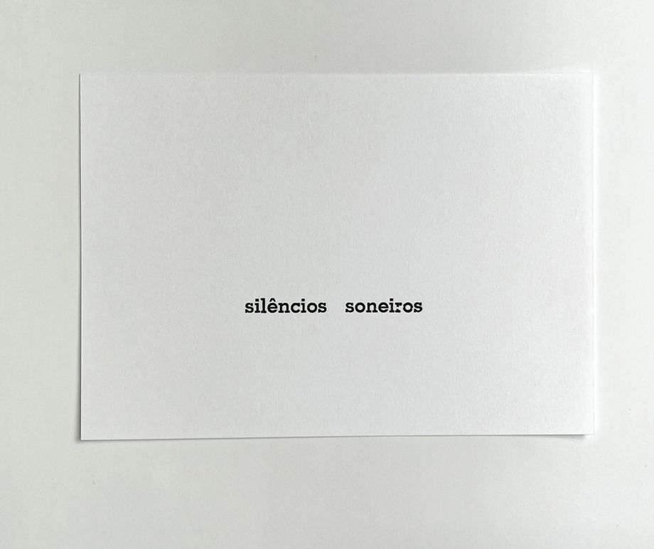
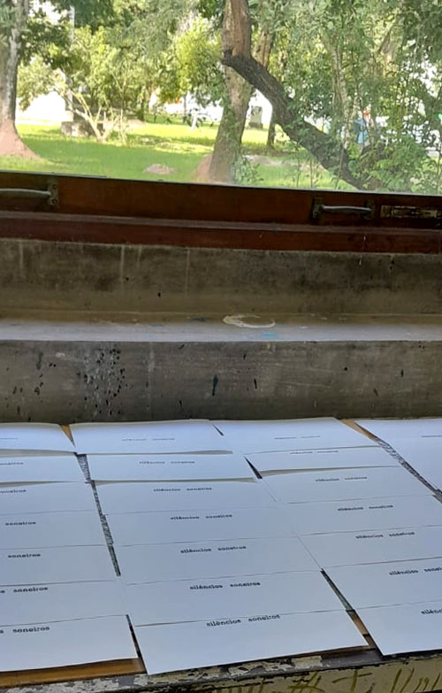

  

_raquel stolf, *silêncios   soneiros*, 2025. A partir da dicção-desvio de *silêncios costeiros*, durante uma fala em vitória-es. fotografia de isabella de campos_

Raquel Stolf compôs com a fonte memphis esta publicação, em junho de 2025, quando esteve na Ufes para participar do projeto *Noites Experimentais* do GEXS.  
A impressão tipográfica foi de aline dias, em uma parceria **céu da boca** e projeto **ofício febril**, tiragem de 20 exemplares (1a edição). 

_processo de impressão na oficina, fotografia de aline dias_

