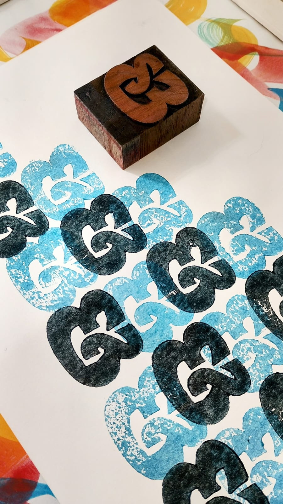
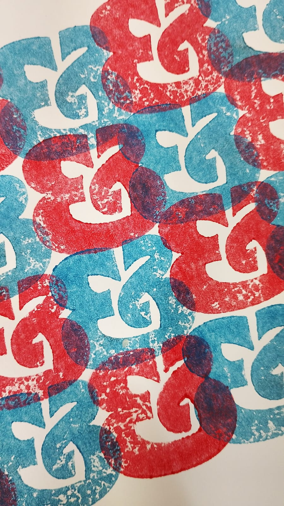

Com os recursos do projeto *ofício febril: primeiras impressões*, viabilizamos a produção de tipos de madeira por Nícolas Camargo, [Experimento gráfico](https://experimentografico.com.br/type-graphic-design-page-4/), em Pouso Alegre, MG, onde o designer e marceneiro vem criando e executando projetos de marcenaria e, especificamente, voltados para a tipografia.  
Nossa primeira encomenda foi a produção de um set de caracteres da fonte *Ponta Text Black*, desenhada por Ricardo Esteves. A Ponta foi impressa no livro [Escutar a escrita](https://escritaemartes.wordpress.com/2024/12/05/e-book-escutar-a-escrita/, do projeto de extensão *Escrita em artes*.
Além da Ponta, produzimos alguns caracteres da Progressiva e da Directa, também desenhadas por Ricardo.

_Ricardo Esteves, composição com um tipo só, fotos do designer_

