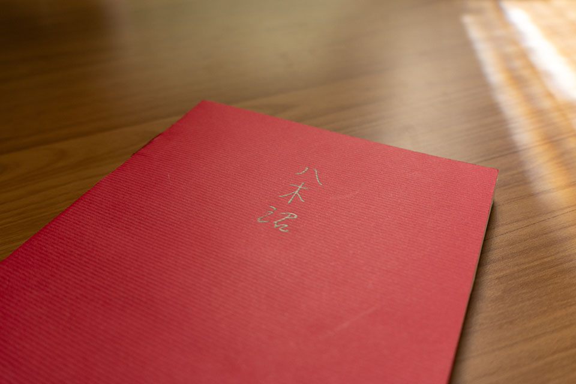
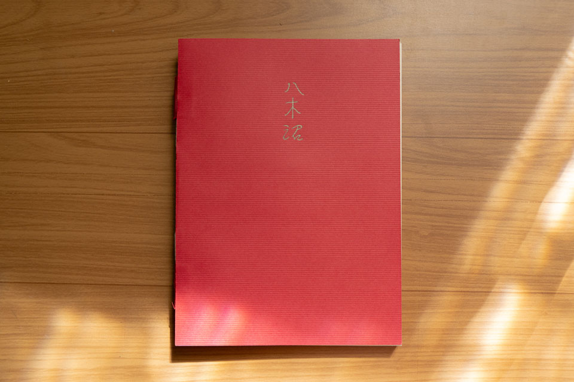
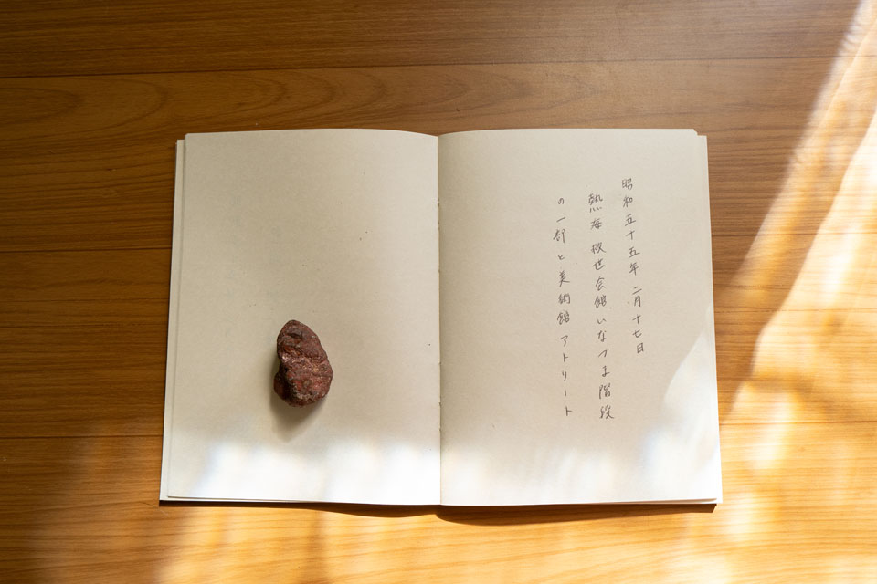
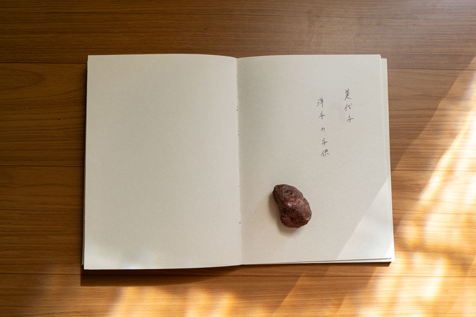
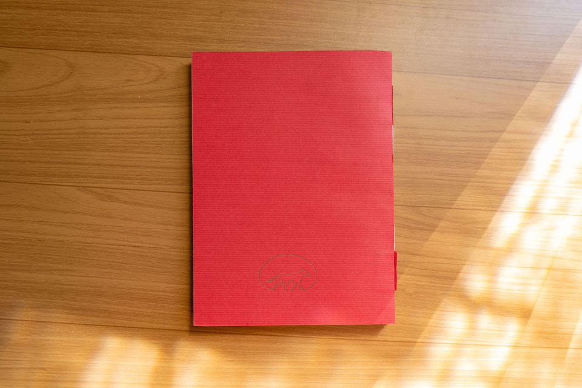
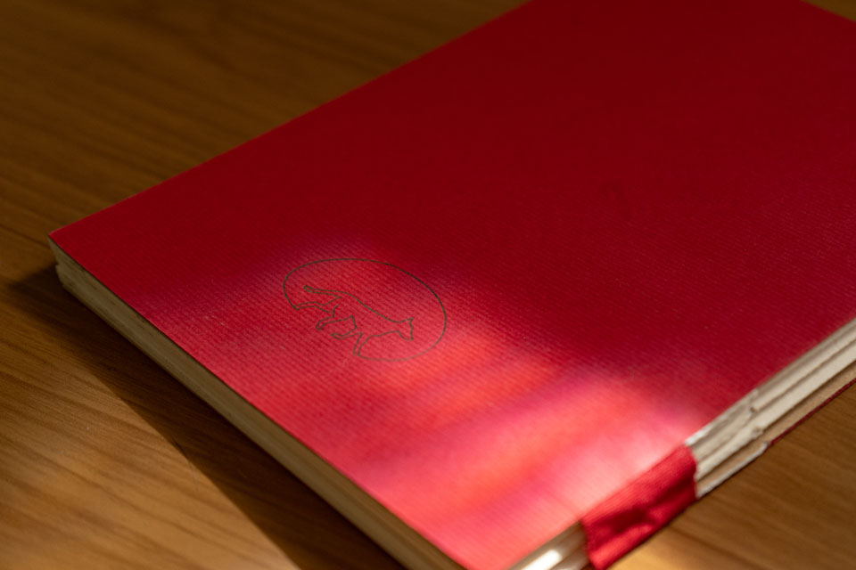


o trabalho 8 árvores no pântano é um caderno para um filme. constituem esse caderno costurado a mão, curtas e rarefeitas anotações em japonês no interior das suas páginas. ele surge da busca pelo caderno real, um dos cadernos de um avô japonês que eu não conheci, e também como fabulação para o filme em desenvolvimento “amar um cão”. sua capa, em papel microcotelê vermelho, foi feito com a impressão de dois clichês na oficina de tipografia do departamento de artes visuais da ufes no contexto do projeto “ofício febril: primeiras impressões”. 

_yurie yaginuma, *8 árvores no pântano*, 2026, caderno, 14,8 x 21 cm, foto da artista_

as anotações inscritas no seu interior evocam uma escrita possível feita da montagem de fragmentos da caligrafia japonesa encontrada nas legendas dos álbuns de fotos dos meus avós. essas fotos, referentes à sua primeira viagem de volta para o japão em 1980, revelam um contexto de reencontros com lugares, familiares, nomes. as legendas todas seguem o padrão de anotação do lugar e a data onde a imagem foi feita. às vezes também indicam o nome e a idade das pessoas na foto. a caligrafia encontrada nesses álbuns, cujas mãos acredito serem as do meu avô, passaram para as mãos de Sakura Watabe, minha professora de japonês, que me ajudou a ler, montar e transcrever os textos.
foi a Sakura também quem possibilitou ler pela primeira vez os signos japoneses, os kanji, que compõem a escrita da capa impressa com clichê. muitas vezes encontrados nas legendas dos álbuns referidos, esses três signos poderiam ser traduzidos como o sobrenome de minha família. mas, como aposto de maneira mais interessada, também pela tradução de seu sentido ideográfico: 八 ([hachi], [ya], 8), 木 ([ki], [gi], “árvore”) e 沼 ([numa], “pântano”). 8 árvores no pântano.
não é o caderno real, mas remontado, fabulado. acredito que ele não poderá ser lido pela maior parte das pessoas para quem o mostrar, escrito em outra língua e outro sistema gráfico que os nossos. posso apenas imaginar, para o seu futuro e latente leitor de japonês – que também não sou eu –, o que essa estranha montagem de nomes, lugares e datas, sem o referencial imagético, poderá evocar.

_yurie yaginuma, *8 árvores no pântano*, 2026, caderno, 14,8 x 21 cm, foto da artista_

a impressão da capa foi realizada com apoio do projeto “ofício febril: primeiras impressões”, com a preparação para impressão dos clichês por Diego Rayck e as impressões tipográficas por Aline Dias. a encadernação foi feita por Letícia Marinato. a escrita de seu miolo foi feita em uma tarde com Sakura.

