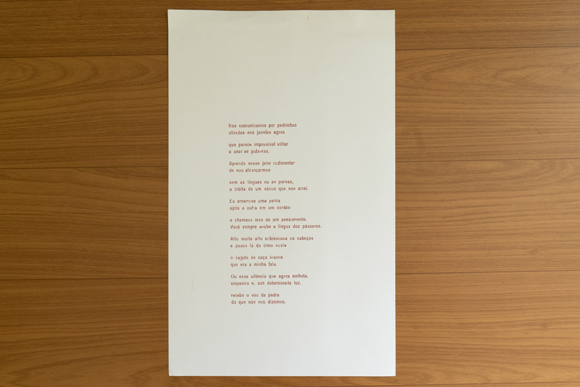
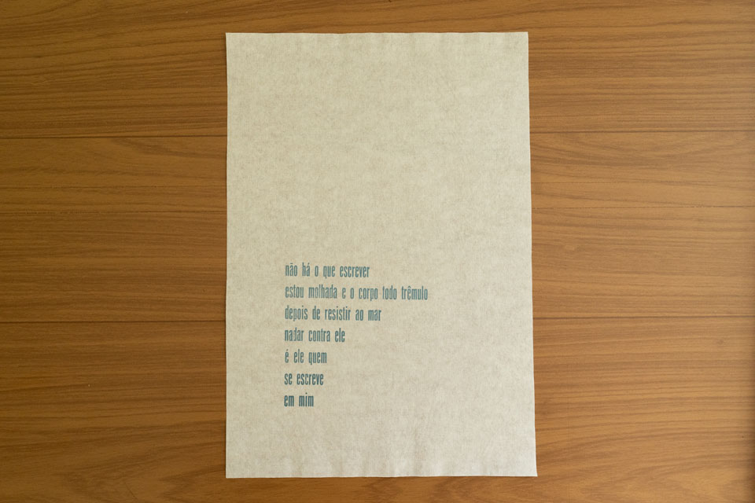



impressão tipográfica de dois poemas realizada no contexto do projeto “ofício febril: primeiras impressões”.

_yurie yaginuma, *Nos comunicamos por pedrinhas*, 2025, 20 x 31,5 cm, foto da artista_

_yurie yaginuma, *não há o que começar a escrever*, 2025, 16,5 x 23 cm, foto da artista_

