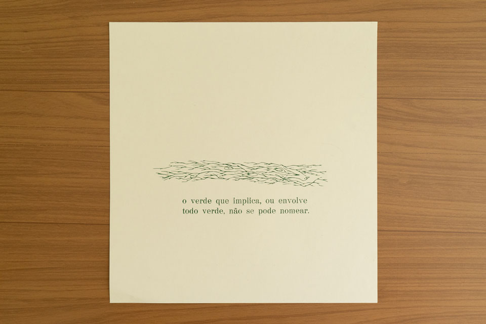

impressão tipográfica de um verso de Maria Gabriela Llansol com clichê de Aline Dias e Diego Rayck (desenhado a quatro mãos para a exposição *pele abissal* de Marcos Martins) realizada durante a oficina de Cristiano Moreira, Patrícia Costa e Jakson Chiappa (da oficina tipográfica Papel do Mato) em novembro de 2025. é uma semente inicial para um projeto de publicação chamado coleção verde.

_yurie yaginuma, *o verde de Llansol*, 2025, 15 x 20 cm, foto da artista_

