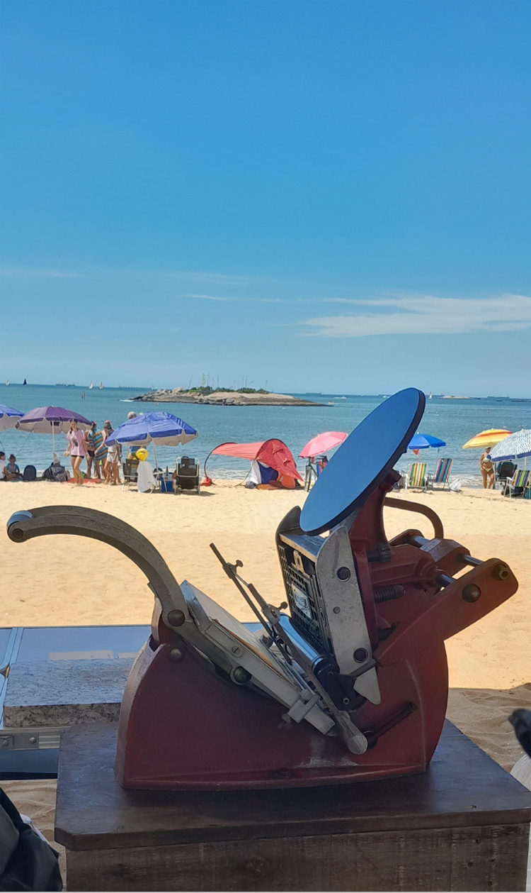
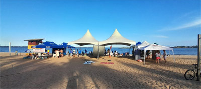
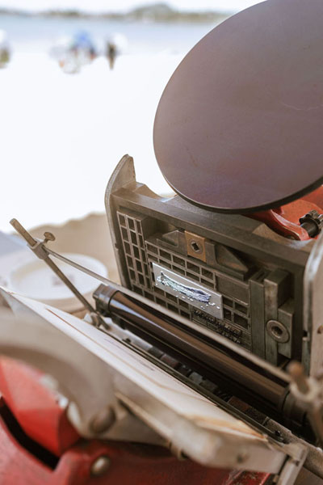
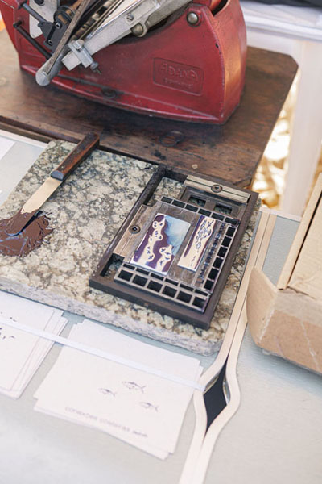
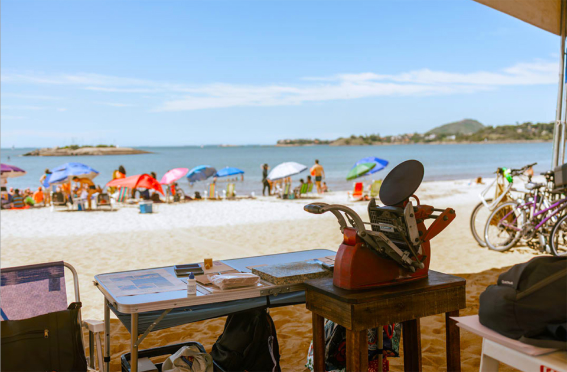
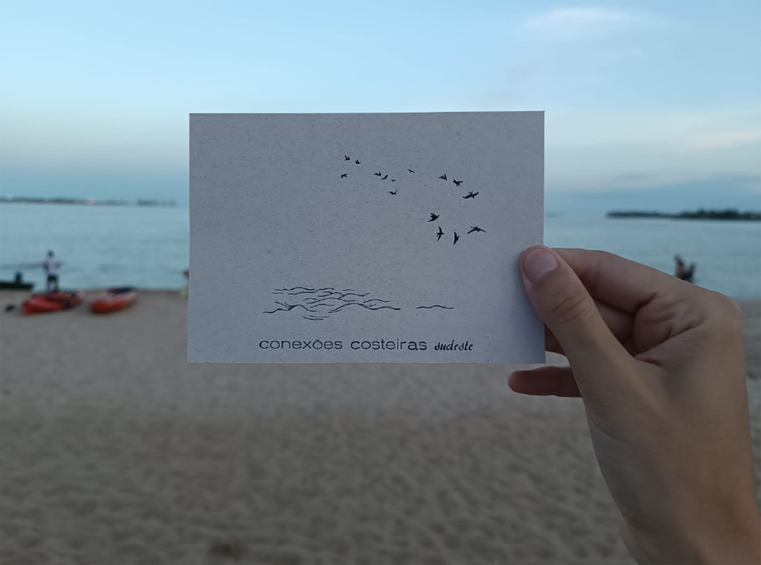
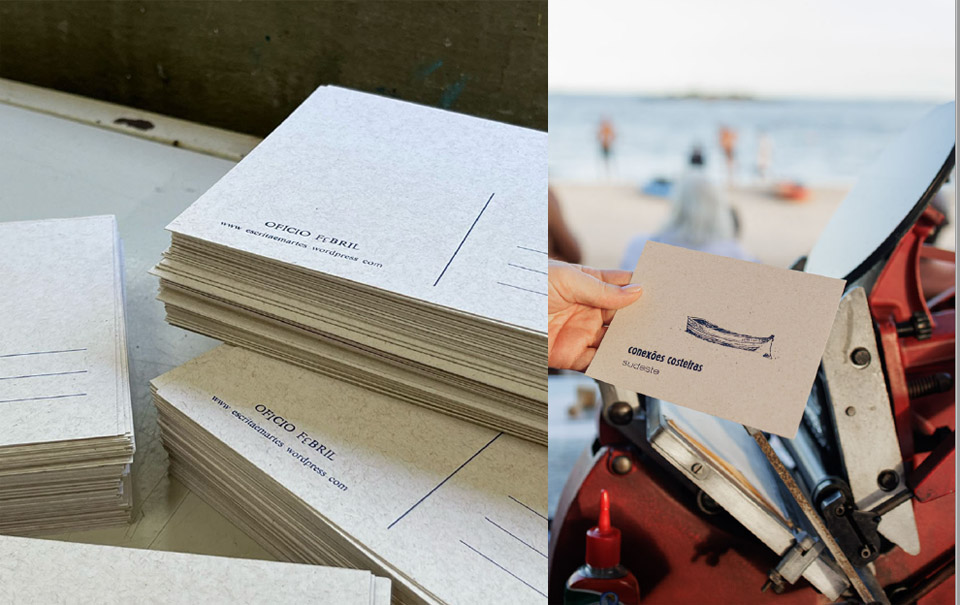
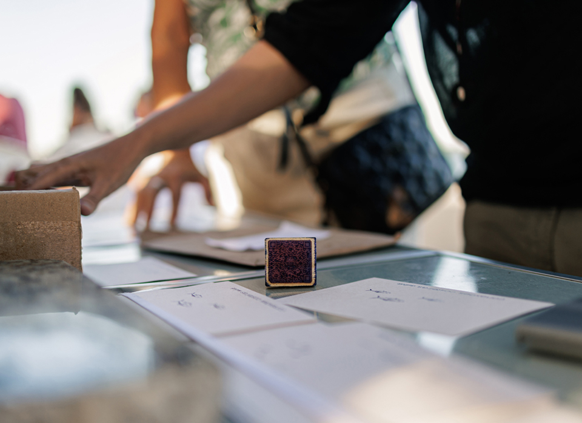
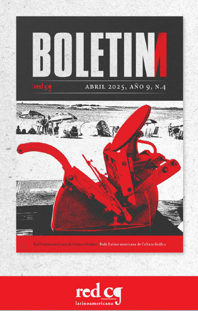


_primeira ação tipográfica do projeto ofício febril: adana vai a praia, março de 2025, fotografia de aline dias_

A primeira ação tipográfica que desenvolvemos foi a partir de uma parceria com o Laboratório de Política Ambiental e Justiça (LAPAJ/UFES) coordenado por Cristiana Losekan através do projeto *Conexões Costeiras Sudeste*.  
O convite para participar da *Maratona Aquática pela Despoluição da Praia de Camburi*, integrada ao evento *Praia Consciência*, atividade de extensão, divulgação científica, educação e conscientização ambiental ligado à Rede de Pesquisa Climatizando foi o mote.  
O evento incluía rodas de conversas em uma tenda aberta ao público onde pesquisadores, professores e sobretudo organizações sociais estiveram reunidas durante todo este sábado na praia: discutindo sobre coleta seletiva e resíduos orgânicos, mulheres no mar, conflitos ambientais, mudanças climáticas e outros temas ligados às regiões costeiras.  

_vista do evento Praia Consciência, orla de Camburi, Vitória e detalhes dos materiais de trabalho_
 
A maratona teve grande adesão, com nadadores e remadores circundando uma pequena ilha por 24 horas. O projeto **ofício febril** propôs duas intervenções artísticas: a produção de cartões postais com tipos móveis e uma projeção de filmes na praia a noite.
 
_vista na prensa tipográfica no evento Praia Consciência, orla de Camburi, Vitória, fotografia de Catarina Altoé Fabre_

As preocupações neste evento, evidentemente, incluíam pesar o impacto ecológico da dispersão de materiais impressos e também a aceleração de leitura e descarte que pautam as estratégias de propaganda em espaços públicos. Trazendo a dimensão anacrônica e a dilatação temporal do nosso ofício para o evento, neste aprendizado de lentidão que é a tipografia manual, intuímos que qualquer material impresso, afastado de seu contexto de produção, deixava uma lacuna para o público desavisado. Desejando compartilhar da forma mais palpável e evidente possível, uma parte do trabalho tipográfico, resolvemos deslocar a prensa para a praia. A imagem é desconcertante na improvável presença deste equipamento obsoleto e pesado no sábado de sol escaldante de 15 de março de 2025, na orla. 

_postal composto por Aline Dias e Diego Rayck, impresso na adana e distribuído na praia, fotografia de Barbara Thomaz_

_postal com desenho de Letícia Marinatto e composição de Ricardo Esteves, fotografia de  Catarina Altoé Fabre_

A ação não se resumia à entrega de um cartão postal, mas convidava as pessoas a olharem o mecanismo de contato, a testemunhar o instante da impressão e a esperar a secagem da tinta recém aplicada. Impressa presencialmente, em tempo real, para cada um, a ação defendia o encontro, neste endereçamento e na recusa do desperdício.  
A pré-produção envolveu desenhar as imagens, vetorizar e produzir os clichês, além de fazer as composições com os tipos móveis do acervo da oficina que, naquele momento, apenas começava a tomar forma.  
Para compor o título do projeto, no verso do postal, não conseguimos encontrar a letra “E” para escrever a palavra “febril” e improvisei usando o número 3 virado. A contingência desta estratégia reverberou e adotamos o recurso quando definimos a logo do projeto.  
Diego produziu uma mesa robusta, iniciando seu oficio de marceneiro na oficina, pois era preciso alguma estabilidade para usar a prensa na areia fofa da praia. Dois nadadores nos ajudaram a carregar mesa, prensa e as sacolas com tinta, papel, materiais de impressão e de alimentação para o dia todo.  
No encontro, conversas surgem e fomos percebendo um parentesco entre as preocupações com ofícios ameaçados pelas lógicas contemporâneas de aceleração e competitividade, como a produção de barcos artesanais, e a demanda de inventar outros lugares e sentidos para saberes que têm sido encurralados pelos modos capitalistas de produção de valor.  
Para divulgar as atividades do projeto Conexões nos meses seguintes, produzi um carimbo com o QRcode do perfil (que apelidamos que carimbo-code), que funcionava didaticamente como um ponto de reconhecimento do processo de impressão, lógica que se expunha na observação da prensa onde demonstrávamos a relação entre matriz, entintagem e papel.

_detalhe do carimbo-code_

_capa do boletim da Rede Latino Americana de Cultura Gráfica_
