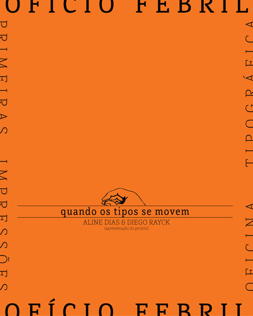
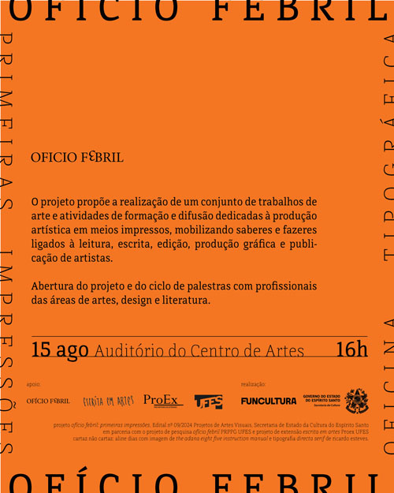

A primeira atividade do projeto **ofício febril: primeiras impressões** acolheu as falas de Aline Dias e Diego Rayck, logo a seguir da palestra de Ricardo Esteves, no dia 15 de agosto de 2025, no Auditório do Centro de Artes da UFES. A apresentação dos artistas Aline Dias e Diego Rayck foi intitulada **quando os tipos se movem**, sobre o encontro com o ofício tipográfico e os processos de impressão e construção de um ateliê de tipos móveis que eles vêm mobilizando na cidade de Vitória.

_imagem de divulgação, projeto gráfico de aline dias_

Na contramão da grande narrativa evolutiva dos fazeres e técnicas humanas, que escutamos tantas vezes sem sequer perceber, Aline e Diego nos apresentaram uma história. 
Iniciando um processo de pesquisa e produção artística que buscou realizar oficinas e residências em ateliês de tipografia em diversas cidades, em especial a tipografia Papel do Mato em Rodeio-SC, a dupla de professores-artistas começou a constituir práticas e saberes atentos a este ofício em vias de desaparição. Desenvolveram publicações artísticas em torno de poemas, desenhos e a atenta observação do resgate ao fazer tipográfico, que apresentaram em sua fala.  
Com o desejo de trazer essa prática para a cidade onde residem, começaram a buscar por tipos e equipamentos de antigas gráficas em Vitória. Junto ao professor Ricardo e diversos colaboradores, resgataram tipos e uma pequena prensa que haviam sido descartados. Começaram, então, a montar o ateliê tipográfico e formularam o projeto ofício febril. 
Uma das atividades que intitulam [**quando os tipos se movem**](https://www.oficiofebril.com.br/quando-os-tipos-se-movem/), é a ação de levar esta pequena prensa operada manualmente, diligentemente restaurada pelo Diego, para espaços fora do ateliê, envolvendo a situação da impressão com o encontro. Uma dessas ações aconteceu na Praia de Camburi durante o evento organizado pelo projeto *Conexões Costeiras Sudeste*, coordenado por Cristiana Losekann, da Ufes, onde os artistas e colaboradores do ateliê levaram a prensa para a areia e imprimiram cartões postais durante o dia inteiro do evento. Outra ação ocorreu no Museu de Arte do Espírito Santo durante o lançamento do catálogo da exposição *Pele Abissal* de Marcos Martins, com a impressão *in situ* de encartes do catálogo.  
Aproximando tais experiências de uma construção de saber indissociável do corpo, como Aline descreveu, as atividades que os artistas coordenadores do projeto **ofício febril: primeiras impressões** vêm praticando ressaltam um compromisso a contrapelo dos intentos evolutivos da narrativa das técnicas de escrita, impressão, leitura e produção de livros. Interessados no restauro, na lentidão e nas situações de encontro e colaboração, as falas de Aline e Diego aproximaram-se daquilo que Leila Danziger viria sinalizar em seguida sobre as possibilidades de se relacionar com o que é ameaçado pela obsolescência e o descarte, mas que guarda tantos nomes, palavras e sentidos em suspensão.  
Relato de Yurie Yaginuma

_imagem de divulgação, projeto gráfico de aline dias_





