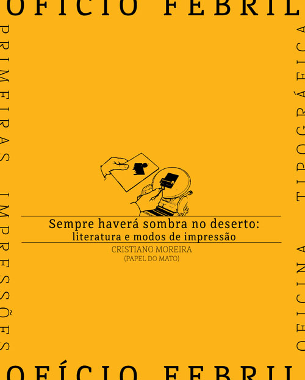
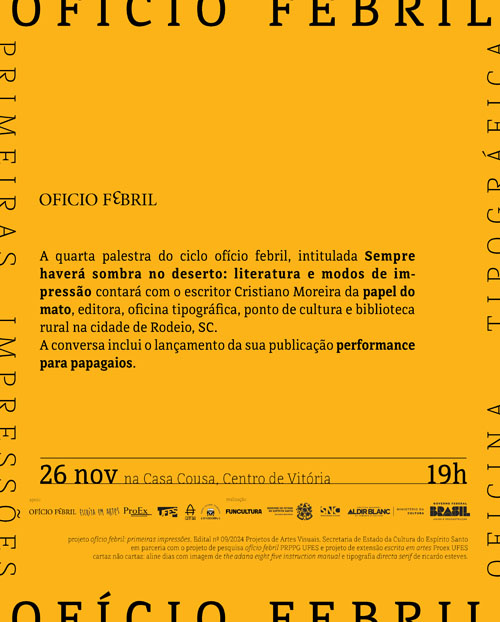
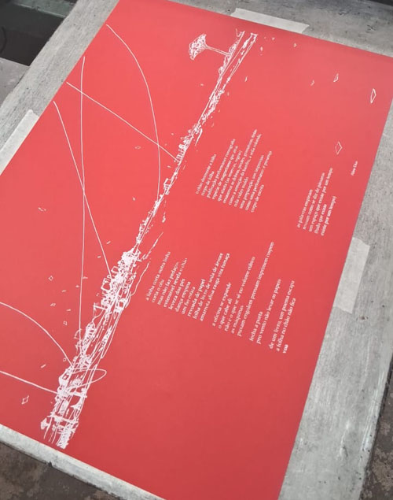

_imagem de divulgação, projeto gráfico de aline dias_

A palestra  *Sempre haverá sombra no deserto: literatura e modos de impressão* de Cristiano Moreira, poeta e tipógrafo da oficina tipográfica [Papel do Mato](https://www.papeldomato.com.br/), foi apresentada no dia 26 de novembro de 2025 na Casa Cousa, no Centro de Vitória, às 19 horas.  
A palestra contou com intéprete de libras e propôs pensar a tipografia como uma estratégia para atravessar o deserto e a aridez do campo político atual. Diante da crise, artistas, escritores e editores precisam desenvolver modos particulares de circulação de seus trabalhos e da partilha do sensível. A tipografia é uma dessas possibilidades de atravessamento, uma forma de abrir espaços para que os textos possam adquirir um respiro, uma sombra para o artista elaborar o caos. Os modos de impressão formam assim uma espécie de constelação que orienta as fugas possíveis da ideia de crise.

_imagem de divulgação_

Durante o evento, também ocorreu o lançamento da plaquete Performance para papagaios, impresso e editado na oficina Papel do Mato, com poemas de Cristiano Moreira, desenhos de Diego Rayck e uma espécie de ensaio-poema de Aline Dias. Os papagaios, ou pipas, são artefatos feitos à mão e, através dela, um fio liga o corpo do chão ao céu. Sob o mesmo céu, habitamos as cidades, os arrabaldes, onde a organização para a performance de empinar pipa-palavra-imagem é semelhante ao fazer poesia. É a força presente na desobediência que organiza estes levantes de corpos flexíveis. O céu das pipas não possui órbita tampouco mapa de navegação. É o espaço dado ao desastre e ao desejo, é um aranzel colorido movido a risadas e gestos maliciosos. Performance para papagaios conta com várias impressões (serigrafia, tipografia com tipos móveis) e várias assinaturas que ensaiam as formas.

_imagem de processo da publicação *Performance para papagaios*_

A oficina Papel do Mato é parceira do projeto ofício febril. O próprio nome do projeto, que deriva de uma publicação de Aline Dias e Diego Rayck foi composta e impressa neste espaço único, que aproxima o oficio dos tipógrafos, Cristiano Moreira e Jakson Chiappa, do trabalho de encadernação manual de Patricia Costa. O trio desenvolve um precioso projeto de formação de leitores, produção cultural e preservação do patrimônio gráfico. A papel do mato tem recebido periodicamente os artistas-coordenadores do projeto para visitas técnicas e residências artísticas desde 2022

