
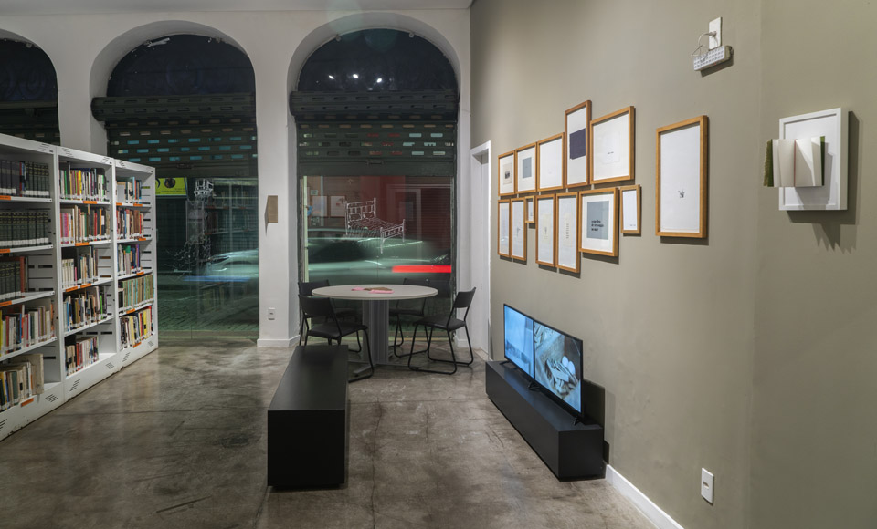
_vista da exposição **primeiras impressões**, na biblioteca do MAES, fotografia de Tom Boechat_

Os trabalhos apresentados na biblioteca do Museu de Arte do Espírito Santo, em Vitória ES exploram as possibilidades da escrita e da leitura no contexto das artes visuais, propondo uma dinâmica singular entre ver e ler. 

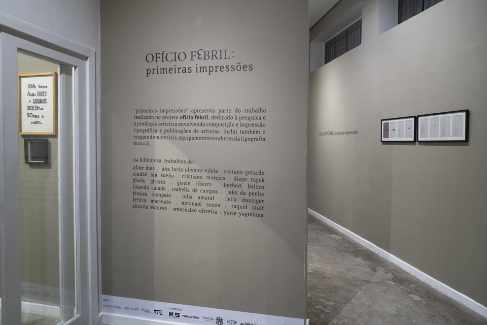

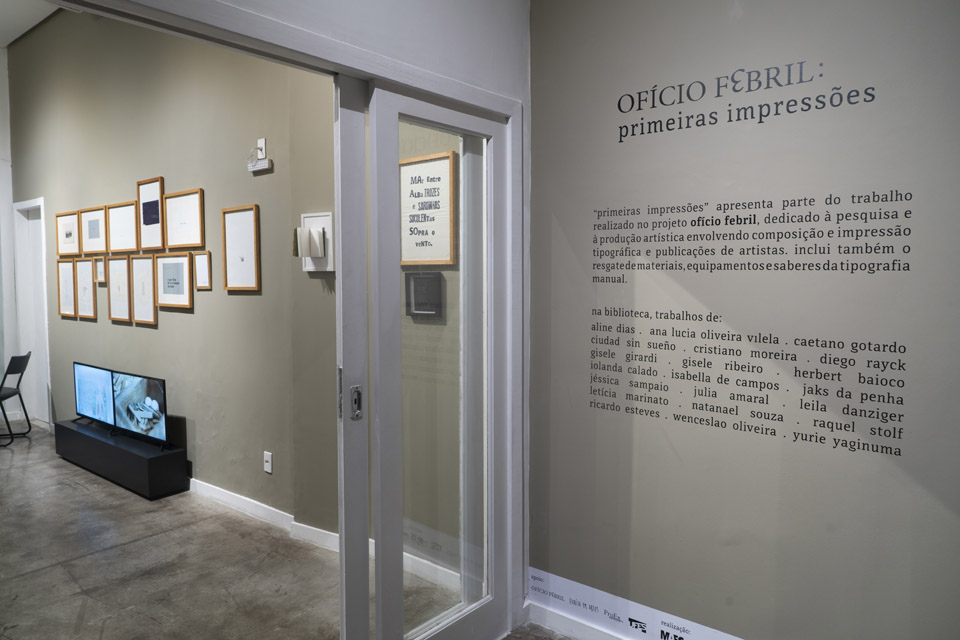

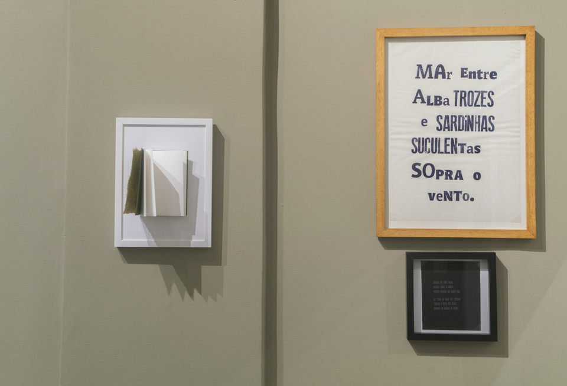

Não por acaso os trabalhos produzidos são apresentados na biblioteca, pois exploram as possibilidades da escrita e da leitura no contexto das artes visuais, a relação entre ver e ler na situação de uma exposição e, sobretudo, pela defesa da leitura e da escrita como formas de reagir e resistir aos efeitos da aceleração e distração geradas pela lógica contemporânea de hiperestimulação e fragmentação. 


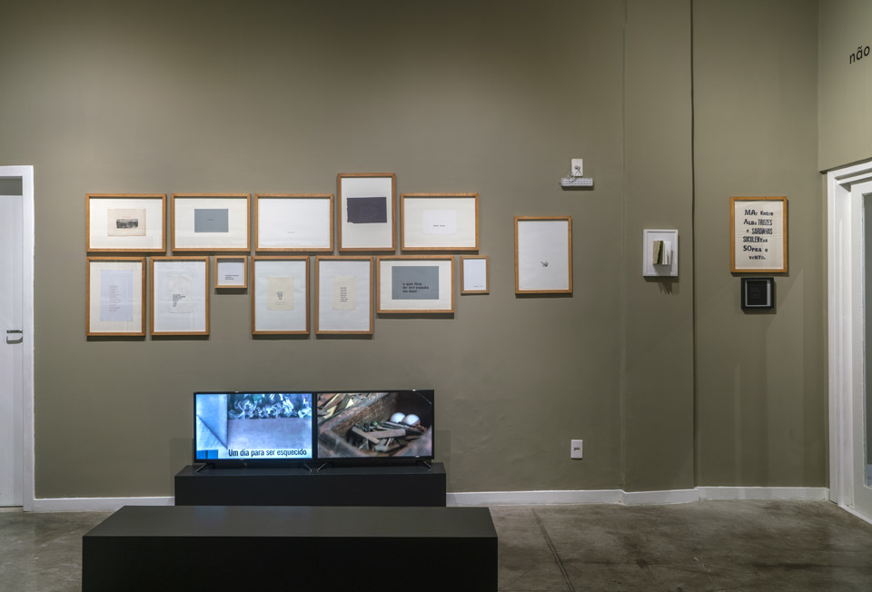

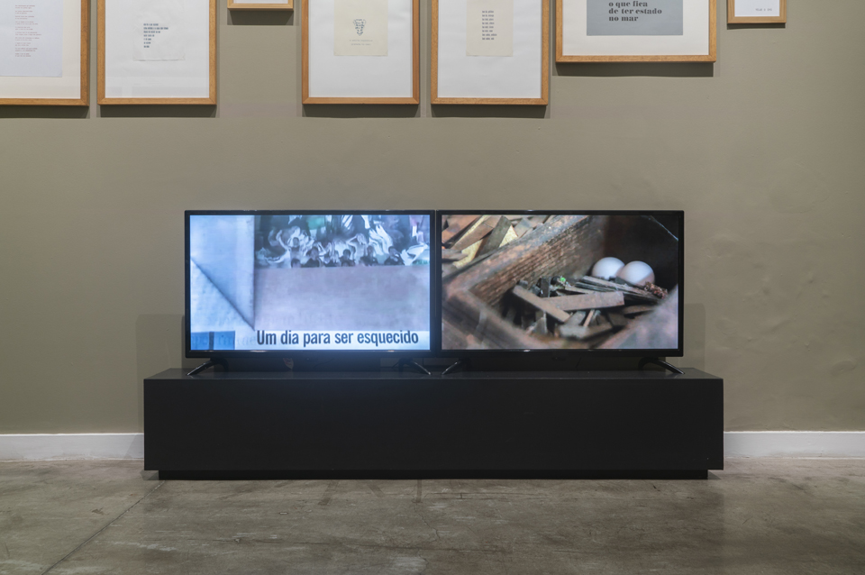

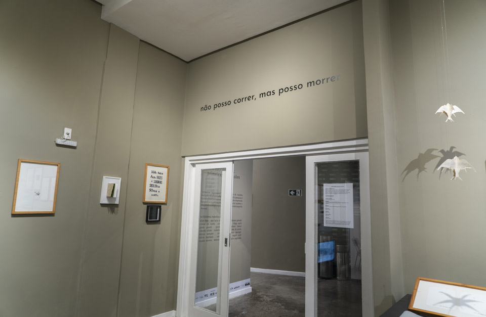

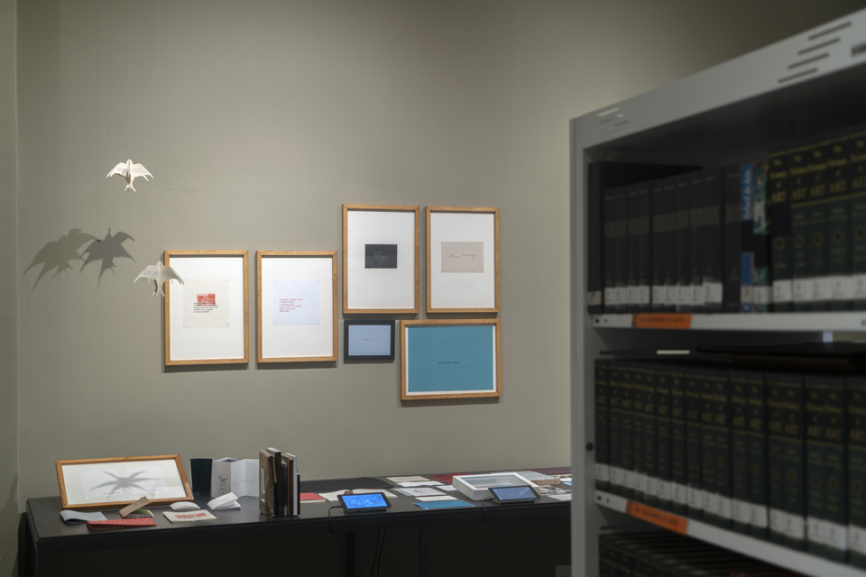

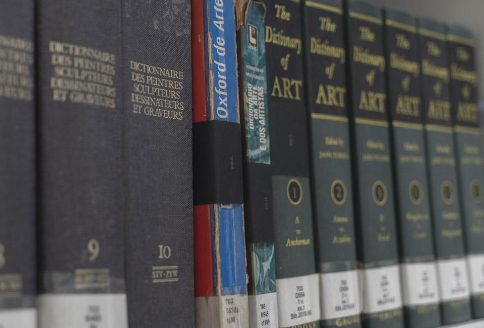

Assim como a biblioteca, o ateliê de tipografia estimula uma relação tátil e singular com o tempo, considerando que as composições se fazem letra a letra com os tipos móveis num processo considerado obsoleto. 

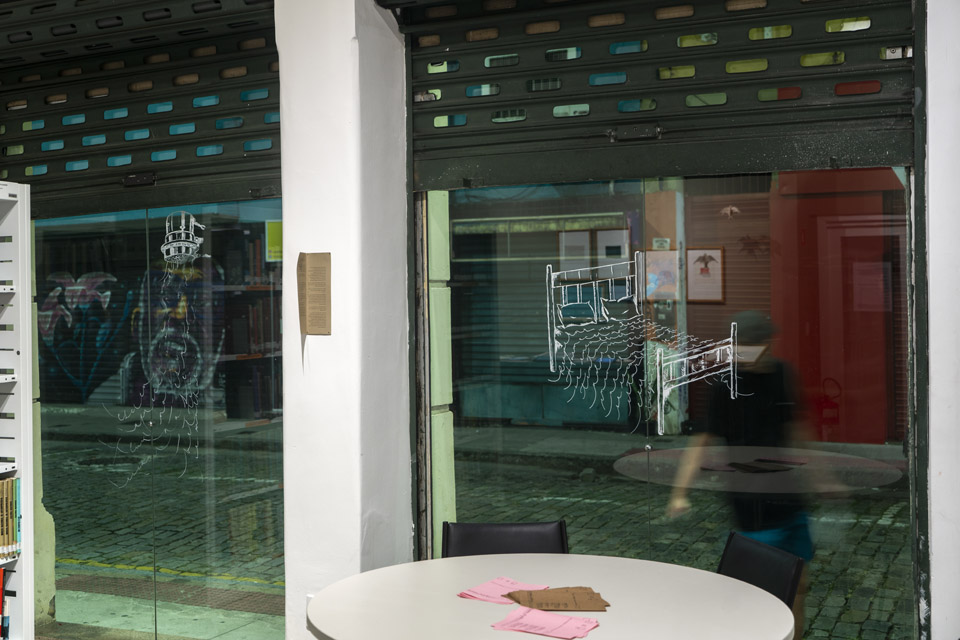

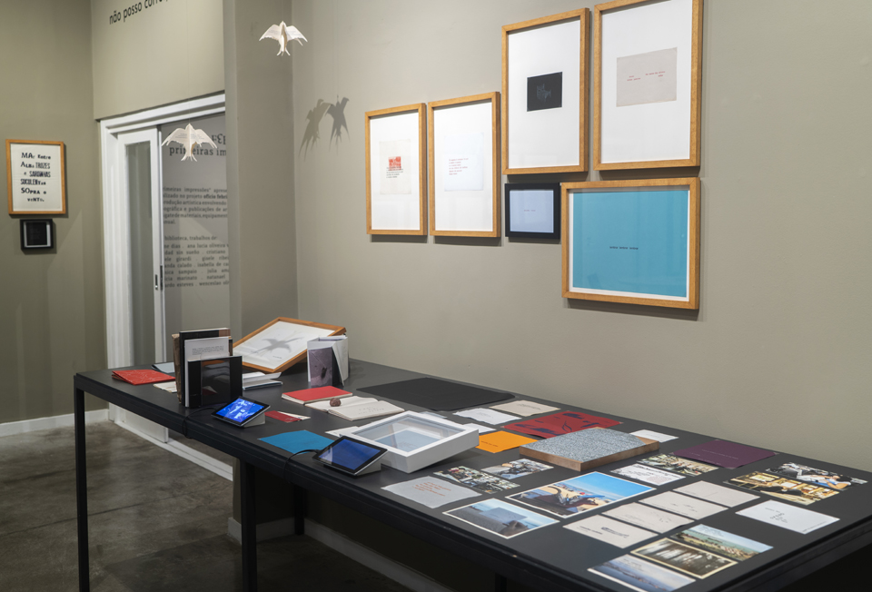

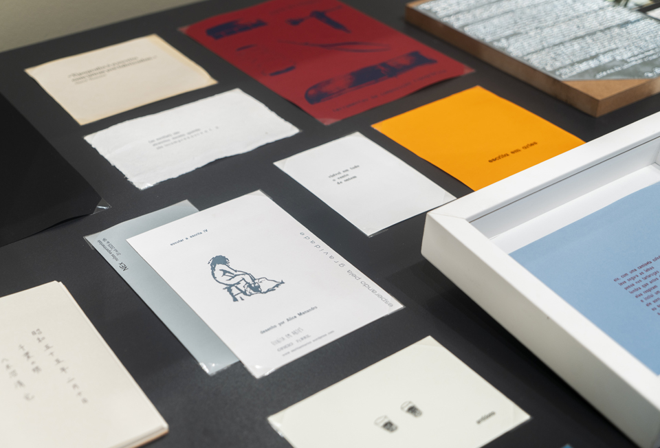

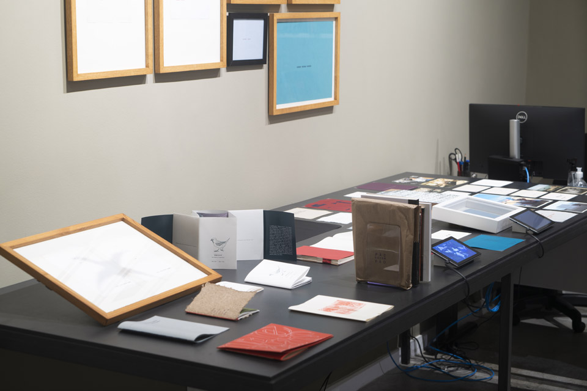
_vistas da exposição **primeiras impressões**, na biblioteca do MAES, fotografias de Tom Boechat_
