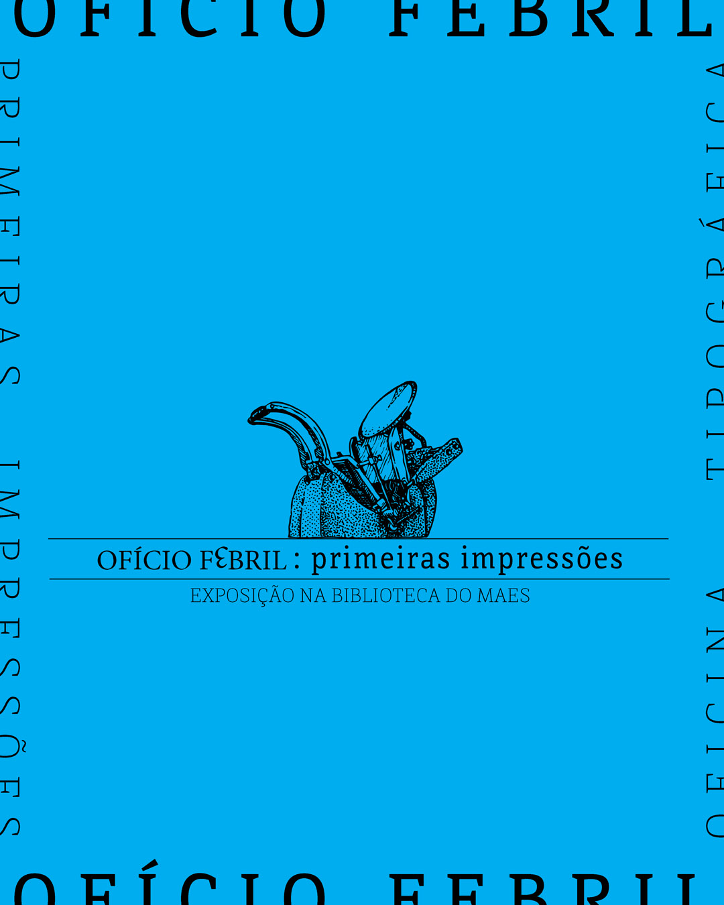
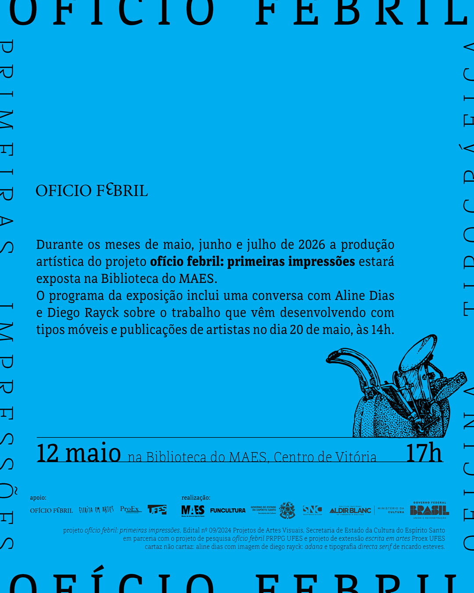


_imagem de divulgação, projeto gráfico de aline dias_

No dia 12 de maio de 2026, às 17h, a biblioteca do MAES recebe a exposição coletiva **primeiras impressões** que apresenta parte do trabalho realizado pelo projeto **ofício febril**.  
Desde 2023 os coordenadores, artistas-professores Aline Dias e Diego Rayck, curadores da exposição, têm mobilizado esforços para a instauração de uma oficina tipográfica no Departamento de Artes Visuais da Ufes, o que permitiu o desenvolvimento dos trabalhos que serão exibidos na biblioteca de maio a julho de 2026.  
A oficina é compreendida como *locus* e condição de possibilidade de produções artísticas ligadas à escrita, leitura e edição, sendo progressivamente constituída através de ações de resgate de saberes e restauro de equipamentos tipográficos, de estudos documentais, visitas técnicas a outras oficinas e do estabelecimento de práticas artísticas e dinâmicas de trabalho colaborativas entre professores, estudantes, artistas, escritores, editores, pesquisadores convidados e outros agentes envolvidos com o contexto da produção tipográfica.  
Entre os artistas e pesquisadores que integram a exposição estão: Aline Dias, Ana Lucia Oliveira Vilela, Caetano Gotardo, Ciudad Sin Sueño, Cristiano Moreira, Diego Rayck, Gisele Girardi, Gisele Ribeiro, Herbert Baioco, Iolanda Calado, Isabella de Campos, Jaks da Penha, Jéssica Sampaio, Julia Amaral, Leila Danziger, Letícia Marinato, Natanael Souza, Raquel Stolf, Ricardo Esteves, Wenceslao Oliveira, Yurie Yaginuma.  

_imagem de divulgação, projeto gráfico de aline dias_

O projeto **ofício febril: primeiras impressões** é realizado com recursos do Edital 09/2024 Projetos de Artes Visuais, Secretaria de Estado da Cultura do Espírito Santo, em parceria com o projeto de pesquisa “Ofício Febril” (PRPPG-UFES) e o projeto de extensão “escrita em artes” (Proex-UFES).





