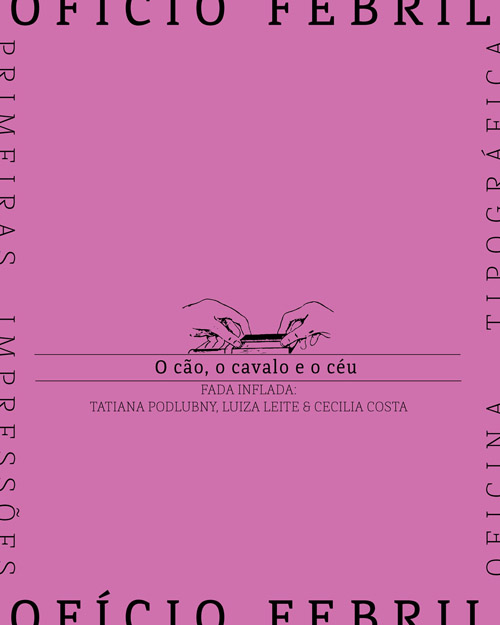
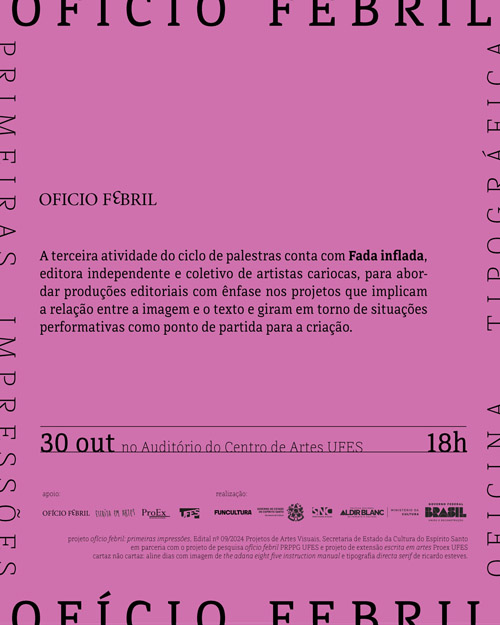


_imagem de divulgação, projeto gráfico de aline dias_

A palestra  *O cão, o cavalo e o céu – a relação texto/imagem como procedimento de criação* com Luiza Leite e Tatiana Podlubny, aconteceu no dia 30 de outubro de 2025, no Auditório do Centro de Artes (Car), às 18 horas. O evento contou com tradução em Língua Brasileira de Sinais (LIBRAS).  
Onde começa a confecção de uma publicação? Antes de uma ideia conceitual ou de um texto pronto, há o corpo no espaço, um corpo que estabelece relações com as coisas, os bichos, as plantas, as pessoas e outros seres. Muitas vezes um livro começa com o que está ao redor. Pode ser uma folha de papel, quem sabe um filhote, ou talvez um encontro.  
Interessadas em livros, artes gráficas, desenho, design, artes visuais, poesia, ensaios, tradução e performance, as artistas da Fada inflada realizam projetos que tensionam as relações entre texto e imagem, em compromisso com as práticas experimentais e colaborativas.  
Na palestra, Luiza e Tatiana relataram os processos e percursos da editora, mostrando seus trabalhos gráficos no final da apresentação, que continuou na proximidade tátil do público que pôde se aproximar, conversar e ver nas mãos as publicações  espalhadas na mesa. Diversos trabalhos apresentados são decorrentes de situações performáticas, em que um gesto inicial põe em movimento uma série de ações, a partir das quais surgem as imagens e os textos. 

_imagem de divulgação_

A [Fada inflada](https://fadainflada.com.br/) é uma editora independente e coletivo de três artistas cariocas que elabora produções editoriais que exploram a relação entre a imagem e o texto e tomam situações performativas como ponto de partida para os projetos editoriais. 




