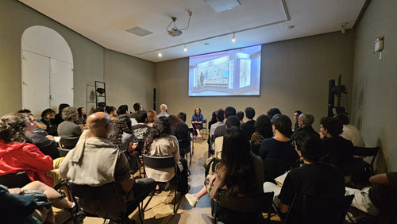
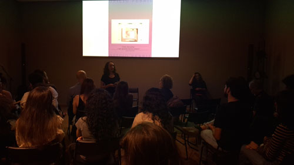
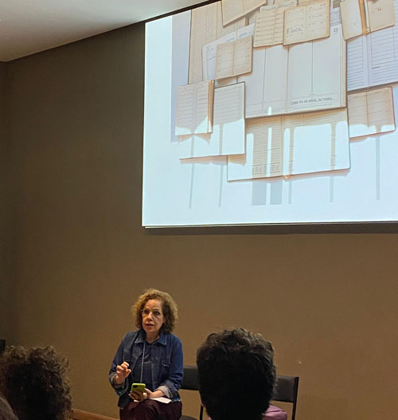

O que fazer com o que é obsoleto, e segue ileso, intocado pelo uso? O que é mineralizado pelo desgaste vira joia? Como descartar o que guarda tantos nomes? Acredito que essas três perguntas orientam boa parte de meus processos de trabalho, realizados com jornais, livros, documentos e objetos diversos, em sua maioria destinados ao descarte ou ao esquecimento. Penso muito na definição de imagem oferecida por Marie José Mondzain: “Chamo imagem o que habita o visível em termos de exigência.” Mas só percebo essa exigência no que é ameaçado pela obsolescência ou desaparição.  
Leila Danziger

, às 18 horas.

Partindo de jornais, livros, documentos e objetos diversos, a artista, que desenvolve um  produção notável no cenário da arte contemporânea brasileira, apresentou um recorte de seu trabalho para um auditório cheio e atento. 

 

_registro fotográfico da palestra no auditório do MAES, setembro, 2025_

Para conhecer o trabalho: [site da artista](https://www.leiladanziger.net/)

