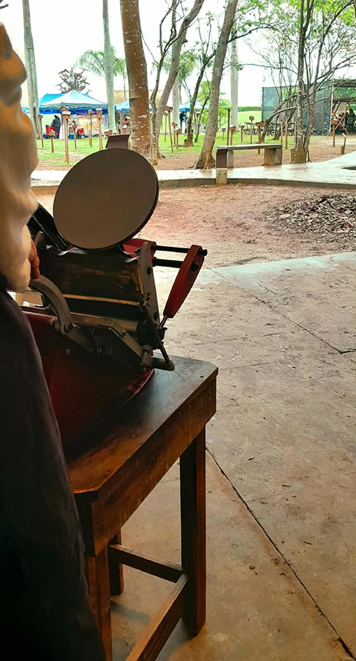

import { Vimeo } from "astro-embed"
 
A frase do amigo, artista e professor Marcos Martins foi publicada online [nesta reportagem](https://eshoje.com.br/entretenimento/cultura/2025/09/cena-cultural-capixaba-se-despede-do-professor-artista-marcos-martins/): *Sejam responsáveis com as outras pessoas e escutem mais, já que a escuta é o professor da fala*. A frase foi lida-e-lembrada por Aline Dias que fez a composição com tipos móveis com Herbert Baioco e Diego Rayck, com apoio de Noemi Masters no ateliê de tipografia. Na frase combinamos duas fontes e na legenda utilizamos caracteres tamanho 10 diligentemente separados por Gisele Girardi com apoio de Nathalia Barata, Sérgio Subtil, Maria Eduarda e outros estudantes a partir dos tipos empastelados na grande bacia.
 
Durante a ação tipográfica na tarde chuvosa do dia 18 de setembro de 2026 na Semana de Arte da Ufes 2026, no Parque Cultural Casa do Governador, cada pessoa presente pôde imprimir com tinta prateada a frase que Marcos nos deixou sobre um cartão de papel verde, com a prensa manual adana. 

<figure>
  <Vimeo id="https://vimeo.com/1228542777"/>
  _Homenagem a Marcos Martins em 18 de setembro de 2025_
</figure>

No fundo deste vídeo podemos ver o seu barco de pau-a-pique suspenso entre as copas das árvores.

_ação tipográfica em montagem: adana na tenda 3 da semana de arte da Ufes no parque_
