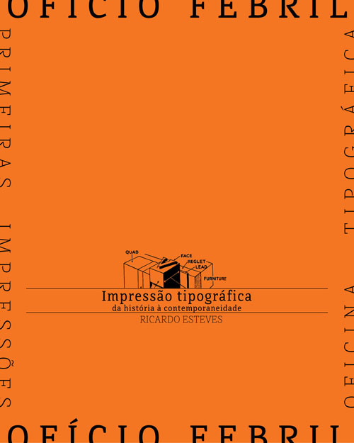
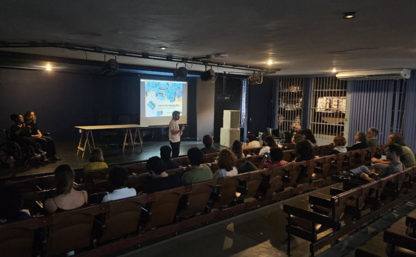
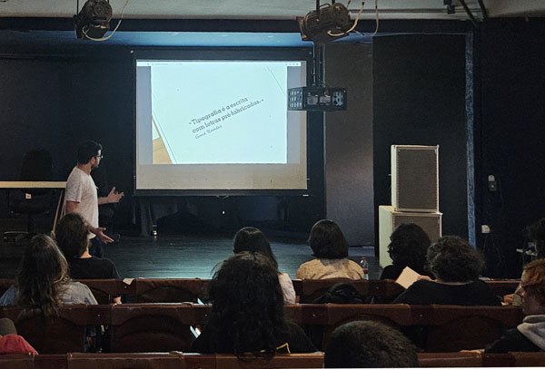

A primeira atividade do projeto **ofício febril: primeiras impressões** acolheu as falas de Ricardo Esteves, Aline Dias e Diego Rayck no dia 15 de agosto de 2025, no Auditório do Centro de Artes da UFES. A abertura do projeto envolveu a partilha com o público sobre a história da impressão tipográfica, apresentada pelo professor Ricardo em sua fala **Impressão tipográfica: da história à contemporaneidade**.  

_imagem de divulgação, projeto gráfico de aline dias_

Partindo do contexto originário do livro no Ocidente, Ricardo, que é professor e designer de tipos, nos mostrou a transformação da mancha gráfica dos manuscritos medievais com a invenção da prensa por Gutenberg. Os primeiros desenhos das letras e elementos textuais em tipos, ainda ligados à caligrafia gótica, se transformaram ao passo que a imprensa se desenvolveu e a prática da leitura se ampliou.  
Ricardo nos apresentou a prática tipográfica transformando-se no interior das primeiras oficinas europeias, procurando um caminho de cada vez maior aceleração e otimização dos processos na escala industrial, até chegarmos à natureza da tipografia das fontes digitais hoje.  
Relato de Yurie Yaginuma 

_registro fotográfico da palestra no auditório do Centro de Artes, Ufes, agosto, 2025_






